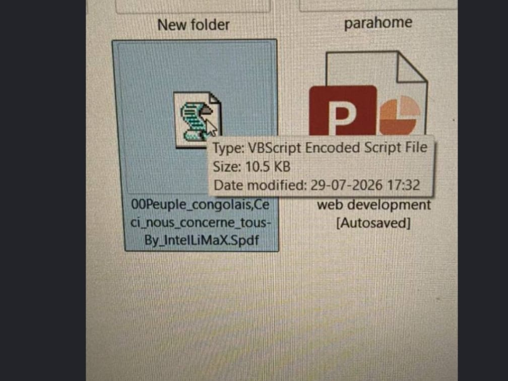
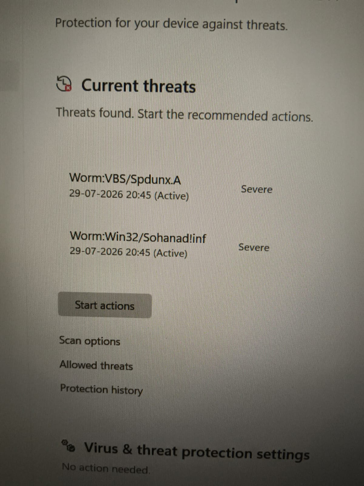
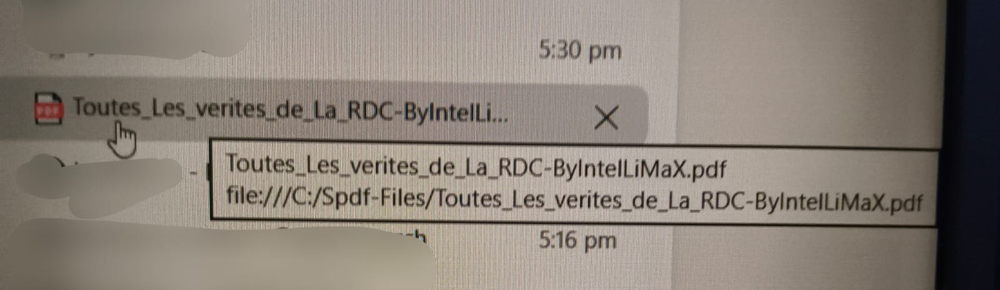
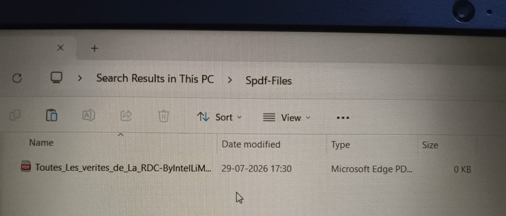

### This documentation file contains the in detailed version of what happened and exactly which step was taken when, while investigating the worms.
It is more like a story. So what happened is that I was sharing some file from my laptop to another pen drive which was new And randomly I thought that I should check my older usb drive.
So I connected it to my laptop, I just found something strange without any thought, I just double clicked that file and it was my biggest mistake.   
The file that was in my Pen-Drive is the one in the screenshot below:    

But I also think that because of double clicking that file and soon after I discover that I did something wrong, because of that I ran the full scan and I discovered two worms which were SPDUNX and sohanad. These were the worms detected:  

After opening this file, a .pdf file was opened:  
  

So I think it benefited me a little because I don't know if another worm was in my device since when. As quickly as I open the file I searched about it on Google Ai It suggested me to delete that file I tried to delete that file but But the file came again and again even after deletion So I knew something is wrong And I quickly Ejected my pen drive And then I disconnected My Device from Internet connection.  And after that I ran the full scan Through Windows defender because I didn't have paid antivirus solution.  So while running the full scan I searched for Spdf, then I came across this "Spdf-files" folder having the same malicious file present in pendrive, on my system.  

 
