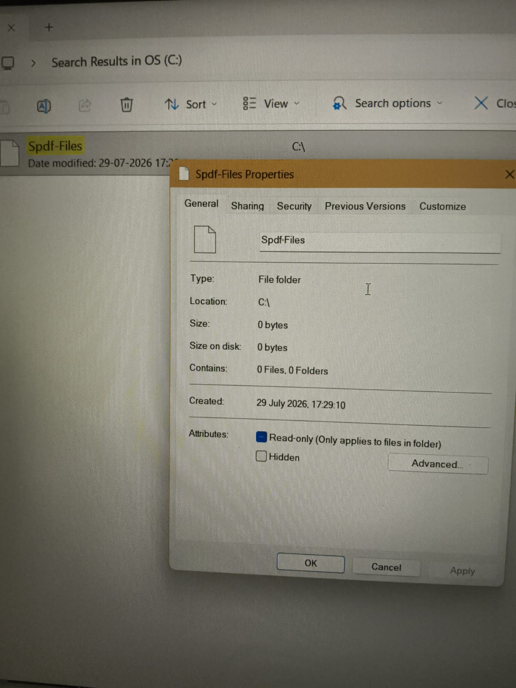
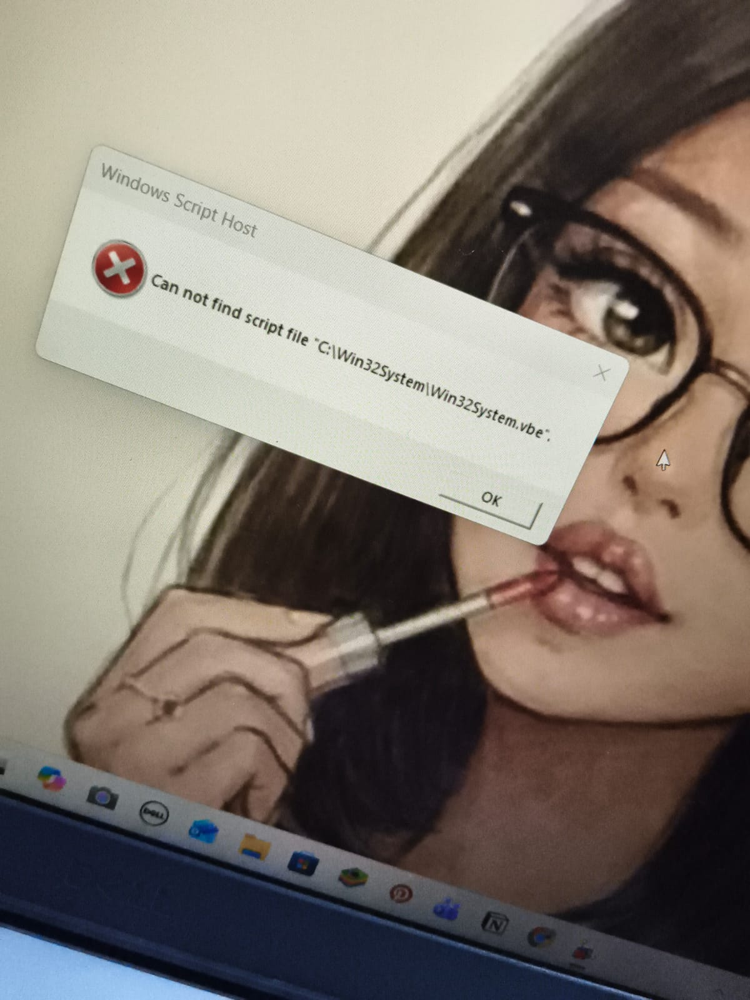
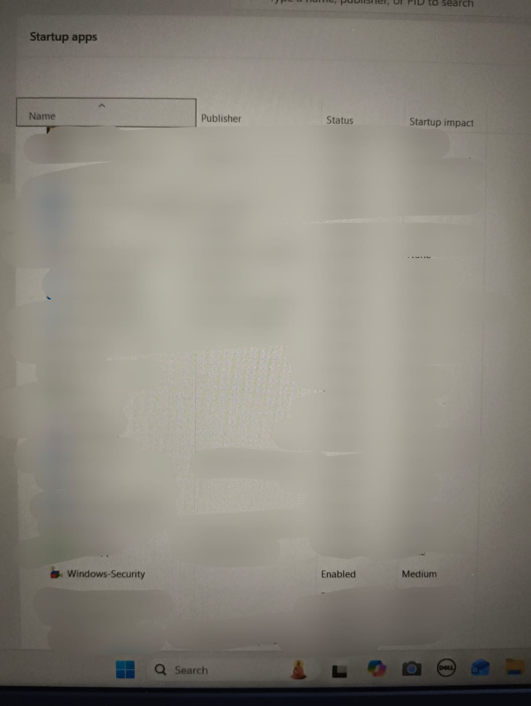
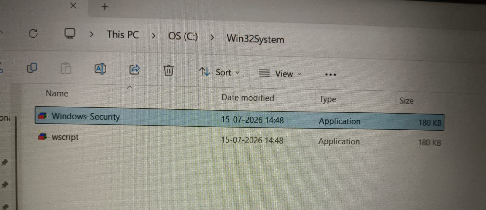
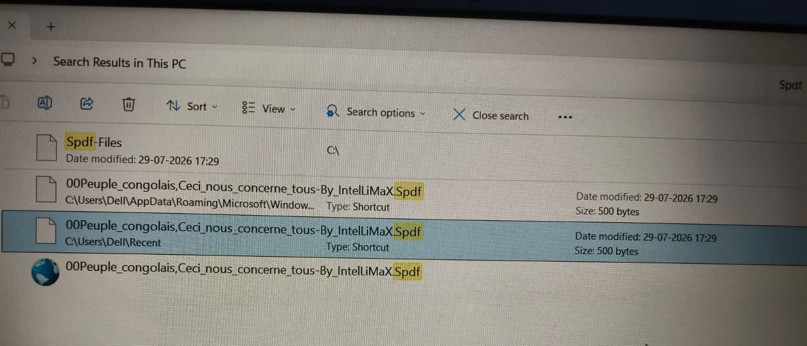
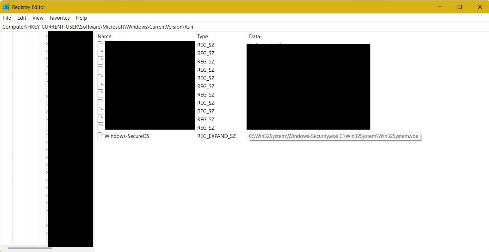

### This documentation file contains the in detailed version of what happened and exactly which step was taken when, while investigating the worms.
It is more like a story. So what happened is that I was sharing some file from my laptop to another pen drive which was new And randomly I thought that I should check my older usb drive.
So I connected it to my laptop, I just found something strange without any thought, I just double clicked that file and it was my biggest mistake.   
The file that was in my Pen-Drive is the one in the screenshot below:    

But I also think that because of double clicking that file and soon after I discover that I did something wrong, because of that I ran the full scan and I discovered two worms which were SPDUNX and sohanad. These were the worms detected:  

After double-clicking the file from USB drive, a .pdf file was opened:  
  

So I think it benefited me a little because I don't know if another worm was in my device since when. As quickly as I open the file I searched about it on Google Ai It suggested me to delete that file I tried to delete that file but But the file came again and again even after deletion So I knew something is wrong And I quickly Ejected my pen drive And then I disconnected My Device from Internet connection.  And after that I ran the full scan Through Windows defender because I didn't have paid antivirus solution.  So while running the full scan I searched for Spdf, then I came across this "Spdf-files" folder having the same malicious file present in pendrive, on my system.  

  

Honestly at first I thought I'm going to be cooked (JK). But the file was 0KB file so I relaxed a little because it wasn't malicious one, didn't open it though.  
And after some time, the file was gone and an empty Spdf-files folder was left for me which can't delete because I simply don't have the privilege to do so.  
  

And then I simply waited for the full scan to complete which Displayed two threats as said earlier. The threats were Quarantined Successfully and then I ran the Antivirus Microsoft Defender (Offline Scan) after which, system restarted and then I got introduced to a new error message.  

  

It was really scary to see this message at first, like there was a persistence mechanism, but still I knew that the file/worm was quarantined now and that's why i got this error message displayed. So I searched for startup apps in my task manager and there I found this suspicious Startup App.  

  

And then I right clicked the file, opened the file location and got here. The same folder which was mentioned in the error message.  

  

After investigating it like file properties, I removed that startup app and deleted this folder. I was still searching for something suspicious and found the .ink extension files along with empty Spdf-files folder. It was scary at first but as I investigated it further, I found out that these search results were just some history of Interaction with some file on USB. Windows creates the recent activity of your USB drive file interaction, so it was okay!  

  

And the last but not the least in my USB Malicious file interaction is that I found the same persistence mechanism on my registry editor, I don't remember how do we say it but I removed it. Also the file/worm was quarantined, but maybe the persistence mechanism was still there even though it was not in the startup app on task manager anymore, but was in regedit. But the file it wanted to run, was already deleted or quarantined.  

And now, at last I have The paid Antivirus solution of McAfee. So yeah, I bought it, because I don't want this to happen again in my near future.  

That's all for my 1st interaction with a real-world threat. I have learned a lot from this Interaction, and will surely not do these mistakes again.
