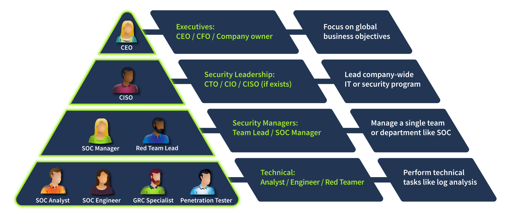

## Module 1: Blue Team Introduction
### Room 2: SOC role in Blue team
The Room covered **Security Hierarchy, Meet the Blue Team, Advancing SOC Career**, through which I understood the internal working and structure of the Cyber Defensive teams.  
**Security Hierarchy** 
  
**Security Departments**
- In tiny companies, the IT department takes the role of securing the company.
- Small to medium-sized companies may have a generic "Information Security" team that does all sorts of tasks.
- Bigger companies have a CISO overseeing **multiple security teams**, each handling a specific task.
    - Red Team: Offensive security experts, pentesters, or ethical hackers who look for security issues.
    - GRC Team: Specialists managing policies and ensuring compliance with regulations like PCI DSS.
    - Blue Team: Defensive security experts like SOC analysts, engineers, or incident responders.

**Meet the Blue Team**: Depending on a company's size and sector, Blue Team can include a lot of different roles and subdepartments, usually counting 3 to 50 members total. 1
SOC is the central hub for an organization's cyber security - they are the first line of defense, work with various alerts, and handle most attacks. An efficient SOC is usually composed of the following roles:
- L1 Analysts: Junior members who triage alerts and pass complex cases to L2
- L2 Analysts: Experienced members who investigate more advanced attacks
- Engineers: Experts in configuring security tools like EDR or SIEM
- Manager: A person who manages the whole SOC team

**Cyber Incident Response Team (CIRT)**: The members should have a broad knowledge of cyber threats and handle breaches without depending on tools like EDR or SIEM. A CIRT job is stressful and responsible, but also rewarding.
They are like the firefighters helping in case of urgency or if SOC expertise is not enough or the incident goes out of control.
Also known as CSIRT (Computer Security Incident Response Team) or CERT (Computer Emergency Response Team) 

Few CIRT examples:
- JPCERT: Japan's CERT handling nation-wide breaches
- Mandiant: A private team responding to global cyber incidents
- AWS CIRT: Investigates security incidents of AWS customers  

**Specialized Defensive Roles**: Large companies, technology-focused startups, and government agencies often require narrow and specialized Blue Team roles - exciting and highly valuable, but requiring deep topic knowledge and broad experience in broader fields like SOC or IT. These narrow roles can include:
- Digital Forensics Analyst: Uncover hidden threats in disk and memory
- Threat Intelligence Analyst: Gather data about emerging threat groups
- AppSec Engineer: Maintain a secure software development lifecycle
- AI Researcher: Study AI threats and how to defend against them

