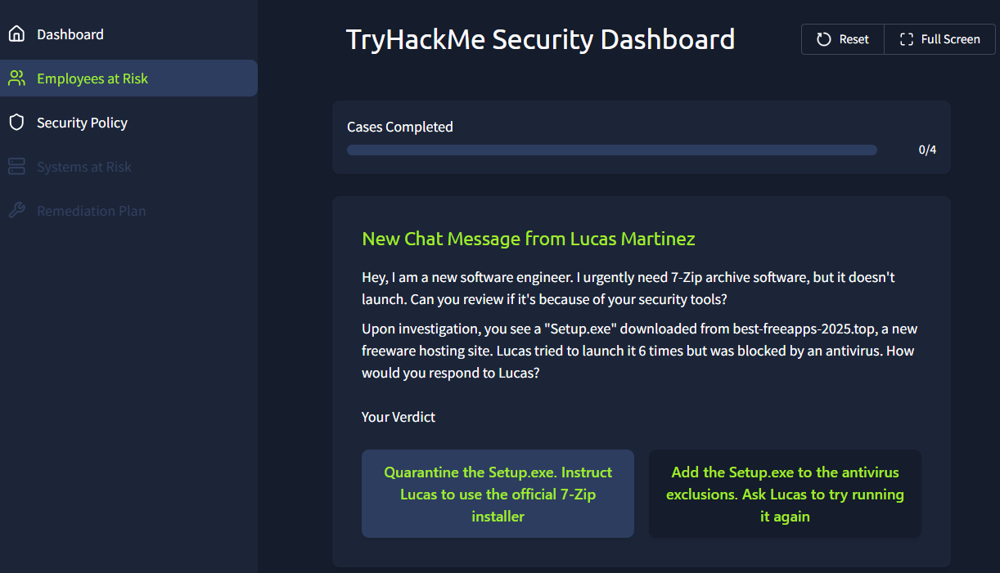
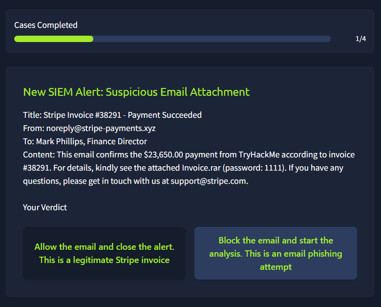
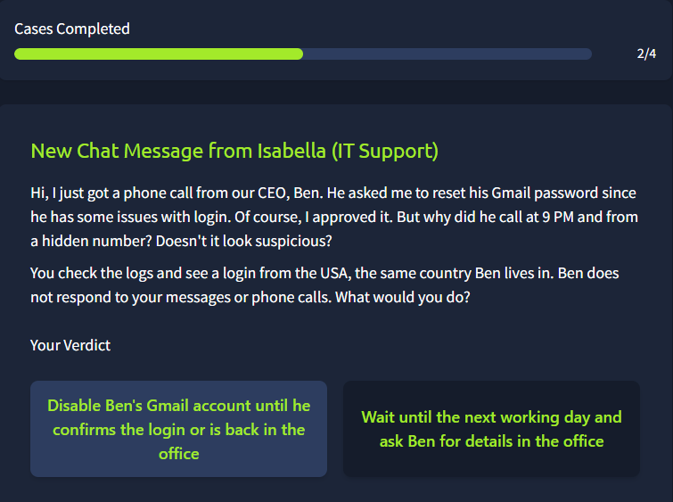
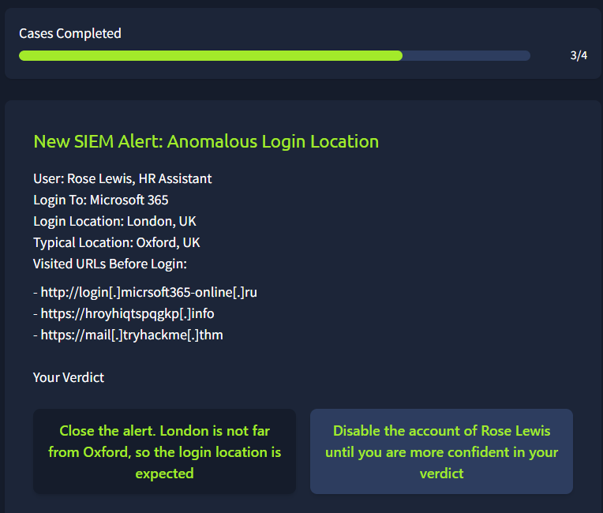
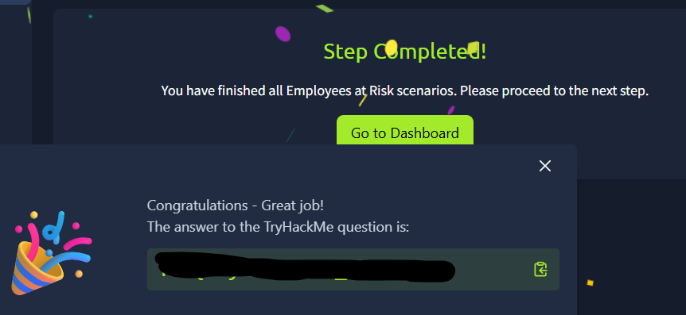
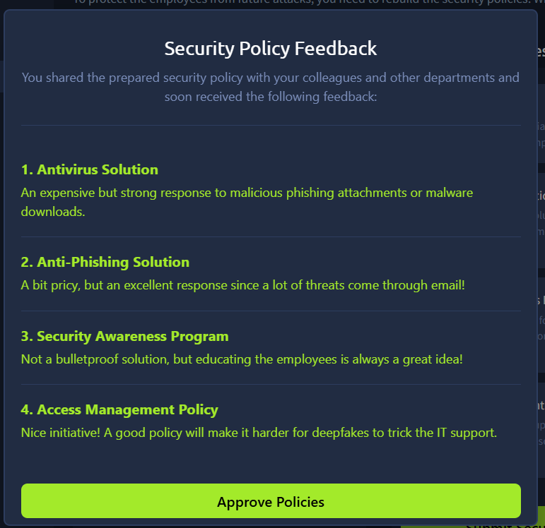
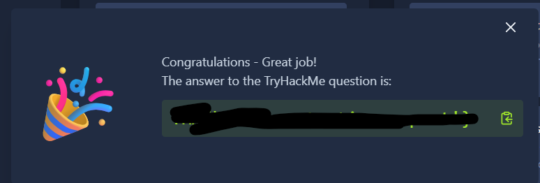

## Room3: Human As Attack Vectors
### What I learned about
   - The role of the human element in cyber security
       - Humans are vulnerable to attackers because they can provide their personal and confidential information or access to mailboxes, websites etc to the attacker themselves without even realizing what they did and thus, humans are considered the weakest link in the cybersecurity.   
       - Some threat actors hunt for a specific access, while others are not so selective and just breach as many accounts as they can and decide how to use them later.  
       - The tactic, known as social engineering, is designed to be trustworthy and emotional (triggering feelings like urgency, fear, or curiosity), thus manipulating the victim into helping the attacker, whether knowingly or not.  
       - Common attacks are phishing emails, malware (threat actors use innovative techniques like fake CAPTCHAs, malicious QR codes, and SEO poisoning), impersonation- with or without AI/deepfakes, USB drop campaigns, physical attacks, insider threats, and even fake job offers.  
   - Understand the SOC role in detecting and mitigating attacks
       - Defending against threats involves two key tasks: Mitigation and Detection.
       - Mitigation aims to prevent or reduce the chance and impact of attacks. However, no matter how good mitigation measures are, one day they are bypassed.
       - That's where your SOC skills are vital to detect and investigate advanced attacks that slip through.
     
--------Mitigation----------------------------------------------------Description-----------------------------------------------------

Anti-phishing solution------------SOC routine becomes easier with a tool that blocks phishing emails before the users even notice  
Antivirus / EDR solution----------A reliable antivirus on all corporate hosts is a great measure to prevent humans from running malware  
"Trust but verify" principle------Instruct your employees how to detect deepfakes and verify suspicious requests from "CEO" or "IT"  
Security awareness training-------Teach your employees how to detect phishing and reinforce training through phishing simulations  

In some teams, analysts just monitor alerts. In others, they are deeply involved in the company's processes. Analysts may:

   - Keep tight connections with the other teams, like IT or HR
   - Propose security improvements and run company-wide trainings
   - even answer hotline calls from employees suspecting the attack

Practice-  

  

  

  

  

  

  

  

