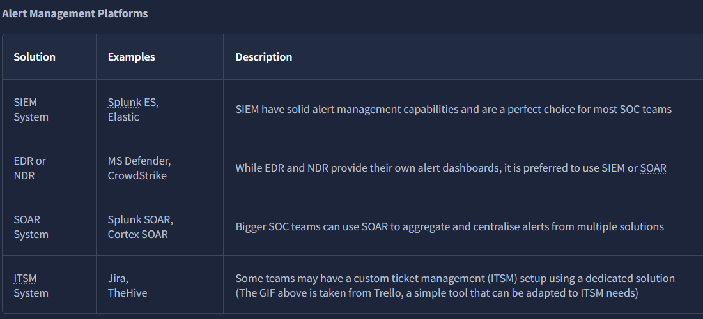
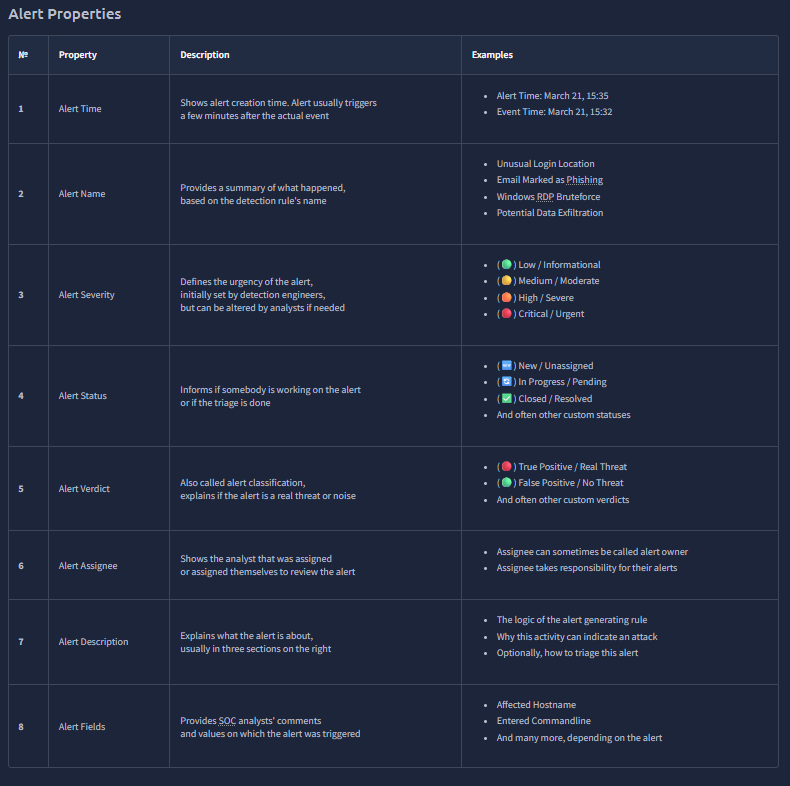
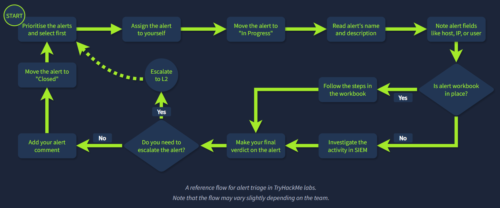
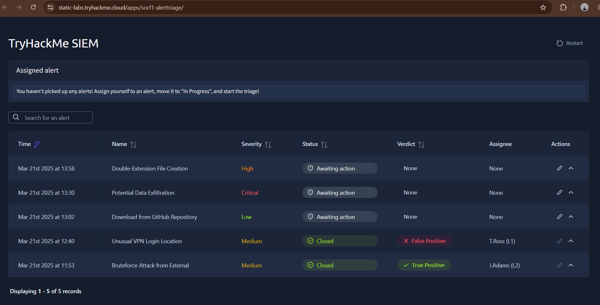
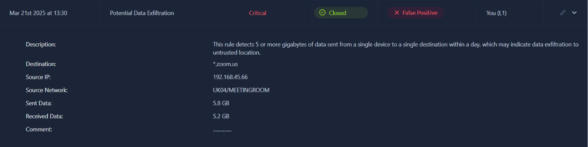
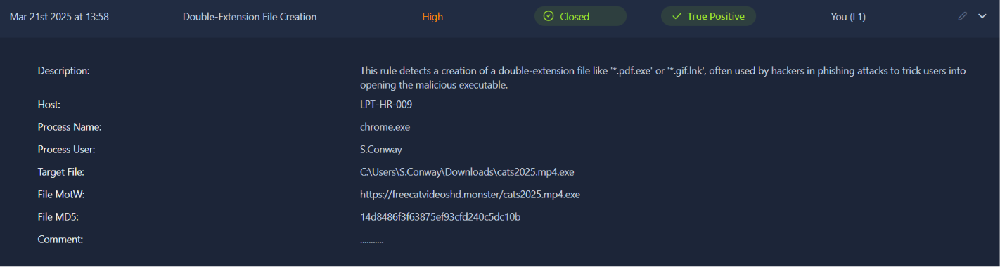
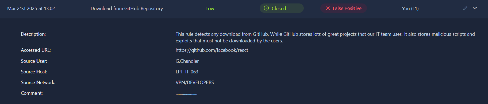

# Module 2: SOC Team Internals
## Room 1: SOC L1 Alert Triage 
### What I learned about:
- The journey of an event to an alert: First, an event must occur. Then, the system, like your OS, a firewall, or a cloud provider must log the event. After that, all system logs must be shipped to a security solution like SIEM or EDR. Security solution generates an alert when a specific event or sequence of events occurs and thus saving SOC analysts from manual log review by highlighting only suspicious, anomalous events.  With alerts, analysts triage just dozens of alerts per day instead of millions of raw logs.    

- Although, L1 Analysts works the most with alerts (1 to 100 alerts per day), every SOC team member is somehow involved in the alert triage:  

   - SOC L1 analysts:  Review the alerts, distinguish bad from good, and notify L2 analysts in case of a real threat.  
   - SOC L2 analysts:  Receive the alerts escalated by L1 analysts and perform deeper analysis and remediation. 
   - SOC engineers:  Ensure the alerts contain enough information required for efficient alert triage.  
   - SOC manager:  Track speed and quality of alert triage to ensure that real attacks won't be missed.

- Alert Properties  

   
- Alert Prioritisation:  The process of deciding which alert to take is called Alert Prioritisation, and it is crucial to ensure timely detection of a threat, especially with many alerts in the queue.
   - The basic/common steps to take up the alert:  
       - Filter the alerts: Only take the alerts which are either new or unseen or unresolved and avoid the alerts already assigned, reviewed or investigated by team members.
       - Sort by severity: Start with critical alerts, then high, medium, and finally low.
       - Sort by time: Start with the oldest alerts and end with the newest ones.
- Alert Review/Triage:  

   
   - First assign the alert to yourself, moving it to In Progress.
   - Follow Workbooks (also known as playbooks or runbooks) - instructions on how to investigate the specific category of alerts, developed by the team. 
   - In case of no available workbook-
      - Understand who is under threat, like the affected user, hostname, cloud, network, or website
      - Note the action described in the alert, like whether it was a suspicious login, malware, or phishing
      - Review surrounding events, looking for suspicious actions shortly after or before the alert
      - Use threat intelligence platforms or other available resources to verify your thoughts
   - First, decide if the alert you investigated is malicious (True Positive) or not (False Positive). Then, prepare your detailed comment explaining your analysis steps and verdict reasoning, return to the dashboard and move it to the Closed status.  
- Practice-  The task is only to determine true/false positives.    

     
   - Perfomed the alert triage on the critical alert first, assigning it to myself, status set to In Progress, reviewed the alert details, set the status to Closed, and verdict as False positive, wrote a .... in comment (as it wasn't necessary), then save, and retrieved the flag.  
      
   - Same procedure followed on high alert  
      
   - Same procedure followed on low alert  
      

### Key Takeaways
  - Alert Management Platforms like SIEM, EDR, SOAR, ITSM 
  - Alert Properties like time, name, severity, status, verdict etc.
  - Prioritization of alerts- critical, high, medium, low.
  - Determination of true/false alert positives with practice on THM lab. 

