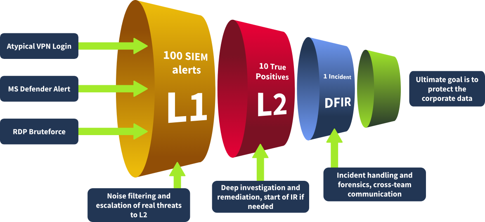
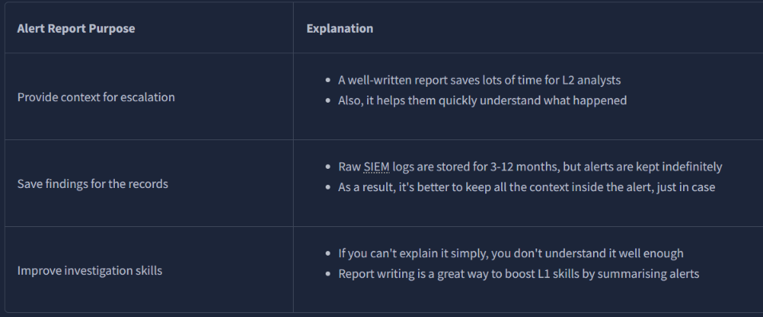
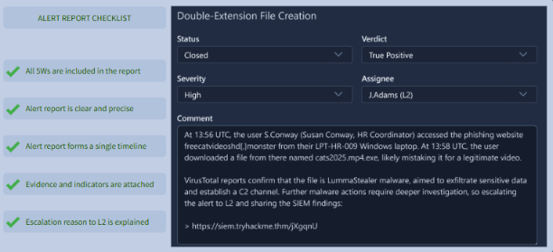

# Module 2: SOC Team Internals
## Room 2: SOC L1 Alert Reporting 
### What I learned about:
- Alert Funnel
   - Alert Reporting: Instead of a short alert comment, it is required to document your investigation in detail, ensuring all relevant evidence is included. This is especially important for True Positives, which require escalation.
   - Alert Escalation: An alert, especially a true positive, is required to be escalated to L2 analyst for further review.
   - Communication: Need to communicate with other departments during or after the analysis.
     
- Reporting Guide:  

      
    - Report Format: Five Ws approach and include at least these items in the report:  
       - Who: Which user logs in, runs the command, or downloads the file
       - What: What exact action or event sequence was performed
       - When: When exactly did the suspicious activity start and ended
       - Where: Which device, IP, or website was involved in the alert
       - Why: The most important W, the reasoning for your final verdict
    - An Example report:  

         
- Alert escalation
    - Escalate the alerts if:  
        - The alert is an indicator of a major cyberattack requiring deeper investigation or DFIR
        - Remediation actions like malware removal, host isolation, or password reset are required
        - Communication with customers, partners, management, or law enforcement agencies is required
        - You just do not fully understand the alert and need some help from more senior analysts
    - To escalate the alert, in most cases, all you have to do is to reassign the alert to the L2 on shift and ping them in corporate chat or in person. In some teams though, you may be required to create a formal written escalation request with dozens of required fields.
    - Requesting L2 Support: It is generally fine for L1 to request senior support if something is unclear. Especially in your first months, it's always better to discuss the alert and clarify SOC procedures than to blindly close the alert you don't understand yourself. 
- SOC Communication: 
    - Communication Cases  
        - You need to escalate an urgent, critical alert, but L2 is unavailable and does not respond for 30 minutes.
            - Ensure you know where to find emergency contacts. First, try to call L2, then L3, and finally your manager.
        - The alert about Slack/Teams account compromise requires you to validate the login with the affected user.
            - Do not contact the user through the breached chat - use alternative contact methods like a phone call.
        - You receive an overwhelming number of alerts during a short period of time, some of which are critical.
            - Prioritise the alerts according to the workflow, but inform your L2 on shift about the situation.
        - After a few days, you realise that you misclassified the alert and likely missed a malicious action.
            - Immediately reach out to your L2 explaining your concerns. Threat actors can be silent for weeks before impact.
        - You can not complete the alert triage since the SIEM logs are not parsed correctly or are not searchable.
            - Do not skip the alert - investigate what you can and report the issue to your L2 on shift or SOC engineer.
### Key Takeaways
- Alert reporting helps to preserve and provide activity context for L2
- Escalation ensures threats are remediated in time
- Communication makes the coordination between SOC and other departments clear and effective.