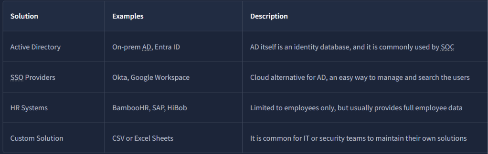
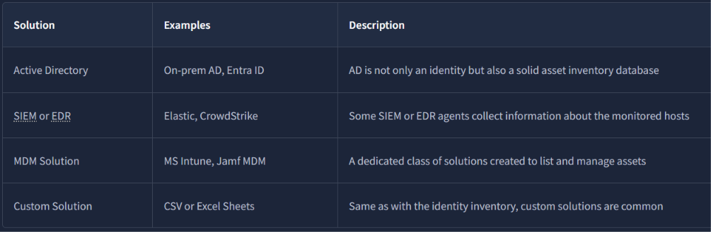
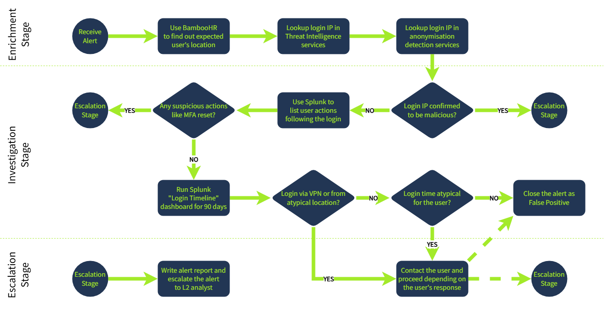
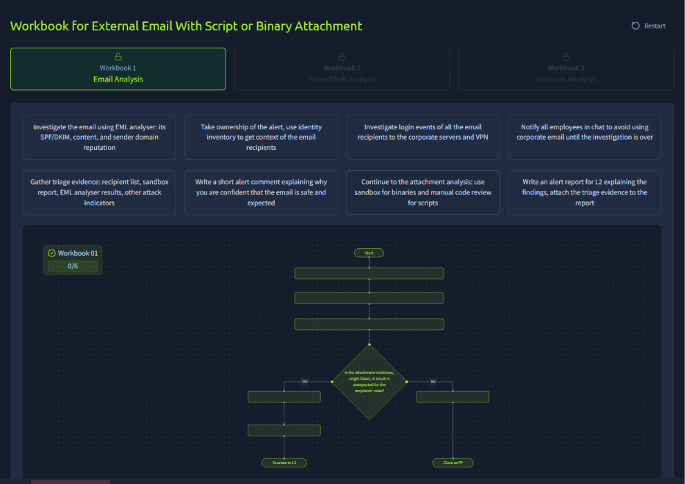
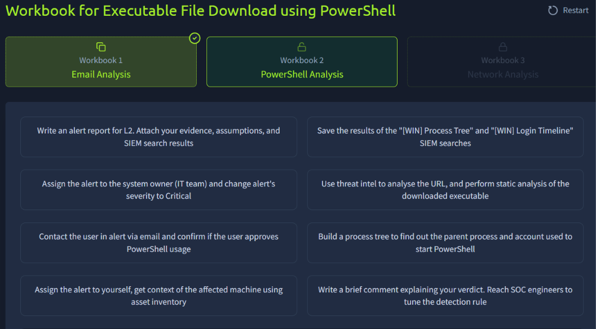
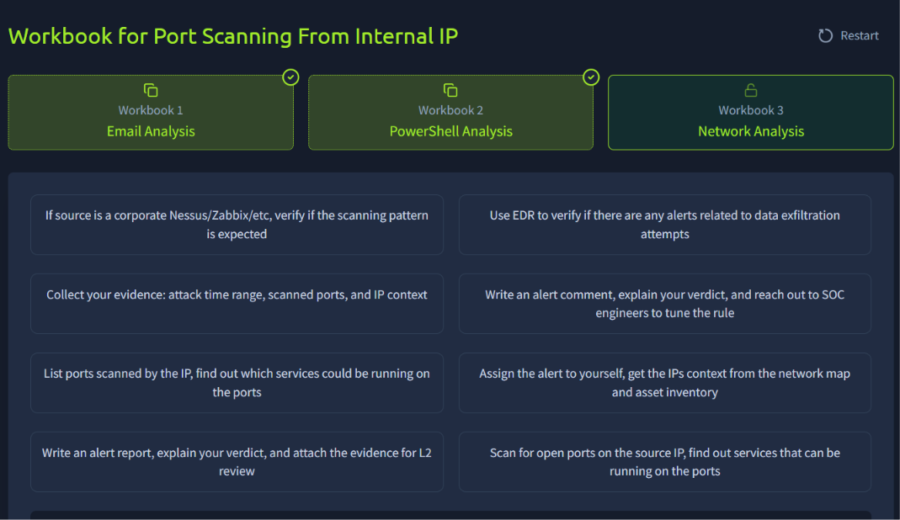

# Module 2: SOC Team Internals
## Room 3: SOC Workbooks and Lookups
### What I learned about:  
- Identity Inventory: Identity inventory is a catalogue of corporate employees (user accounts), services (machine accounts), and their details like privileges, contacts, and roles within the company.
   - Sources of Identities
        

      > Note: SSO - Single sign-on (SSO) is a session and user authentication service that permits a user to use one set of login credentials. SSO can be used to ease the management of multiple credentials.
- Asset Inventory: also called asset lookup, is a list of all computing resources within an organisation's IT environment - software, hardware, employees, servers and workstations.  
   - Sources of Assets  
        
- Network Diagram: A network diagram, a visual schema presenting existing locations, subnets, and their connections, to look at the alert from a network point of view.  

- SOC Workbooks: SOC workbook, also called playbook, runbook, or workflow, is a structured document that defines the steps required to investigate and remediate specific threats efficiently and consistently.  
   - A workbook example:  
        
      By following the steps in the correct order, you can guarantee high-quality alert triage and eliminate cases where the verdict is made without enough evidence:  

     - Enrichment: Use Threat Intelligence and identity inventory to get information about the affected user
     - Investigation: Using the gathered data and SIEM logs, make your verdict if the login is expected
     - Escalation: Escalate the alert to L2 or communicate the login with the user if necessary 
- Workbooks Practice:
    - L1 analyst should know how to divide your investigation into modular blocks and build simple workbooks around it.  
          

       

       

### Key Takewaways
- Understood asset inventory and identity inventory, Workbooks, Network diagrams. 
- Use the existing lookups like asset/identity inventory or network map to better understand the alerts.
- Push your team to implement and maintain workbooks to streamline and simplify SOC operations.