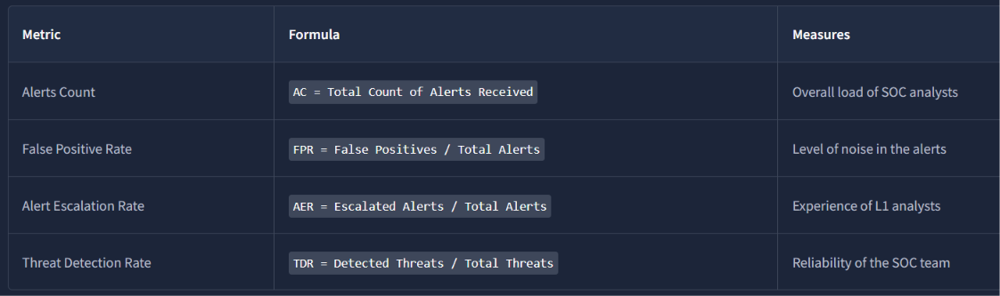
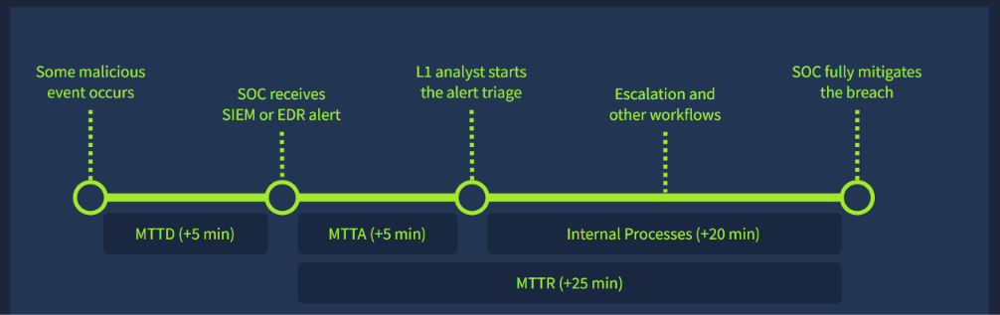
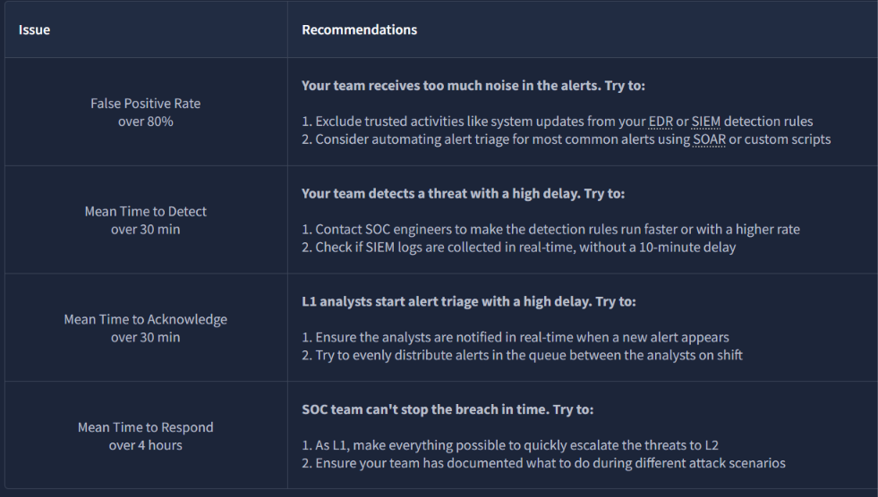

# Module 2: SOC Team Internals
## Room 4: SOC Merics and Objectives
### What I learned about: 
- Core Metrics:
    
    - Alerts Count: Having 80 unresolved alerts in the queue is definitely overwhelming and prone to missing real threats hiding behind the noise spam, but a whole week without any alerts is also concerning since a too low count of alerts may indicate an issue in the SIEM or lack of visibility, leading to undetected breaches. 5 to 30 alerts per day per L1 analyst is a good metric. 
    - False Positive Rate: With more noise, analysts tend to become less vigilant and more likely to miss the threat and treat all alerts just like "yet another spam". A False Positive rate of 0% is an unachievable ideal, but 80% or higher is a serious problem, usually fixed by a tool and detection rules tuning, often called "False Positive Remediation".
    - Alert Escalation Rate: The alert escalation rate comes in handy to evaluate how experienced and independent the L1 analysts are and how often they decide to escalate the alert. It is usually aimed to be below 50%, or even better below 20%.
    - Threat Detection Rate: The threat detection rate should always be at 100% since every missed threat can have devastating consequences, such as ransomware infection and data exfiltration.
- Triage Metrics: An alert by itself will not stop the breach, and it is important to timely receive the alert, triage it, and respond to the attack before the attackers achieve their goals.   
The requirements to ensure a quick detection and remediation of the threat are commonly grouped into a Service Level Agreement (SLA) - a document signed between the internal SOC team and its company management, or by the managed SOC provider (MSSP) and its customers.   

   > Note:An MSSP (Managed Security Service Provider) is a third-party company that monitors, manages, and protects an organization's IT infrastructure from cyber threats.  

   The agreement usually requires quick threat detection (measured by MTTD), timely alert acknowledgement by L1 analysts (measured by MTTA), and finally, prompt response to the threat, like isolating the device or securing the breached account (measured by MTTR)
   
   > Note: Mean Time to Detect (MTTD) is the average time it takes for an organization to identify a security threat, incident, or a technical problem.  

   > Note:Mean Time to Response (MTTR) is the average time between the initial alert and response to it (e.g. malware removal, password reset, or system restore).  

   > Note: Mean Time to Acknowledge (MTTA) is the average time between the initial alert and the service provider (e.g. SOC L1 analysts) taking action.

- Improve metrics: Metrics were built to make the SOC more efficient and, therefore, to make the attacks far less successful. Also, the metrics are often used to evaluate your performance, and good results lead to career growth and a raise to more senior positions like L2 analyst.  
   - If ever encountered issues like these, some recommendations are provided by thm. 

      
### Key Takeaways
- Understood Metrics and its importance.
- MTTR, MTTA, MTTD, SLA.
- How to improve the metics.

   