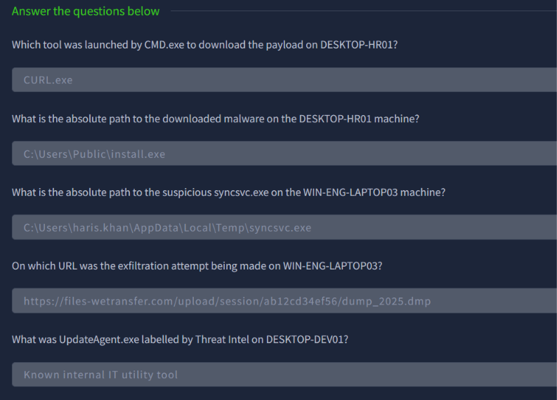
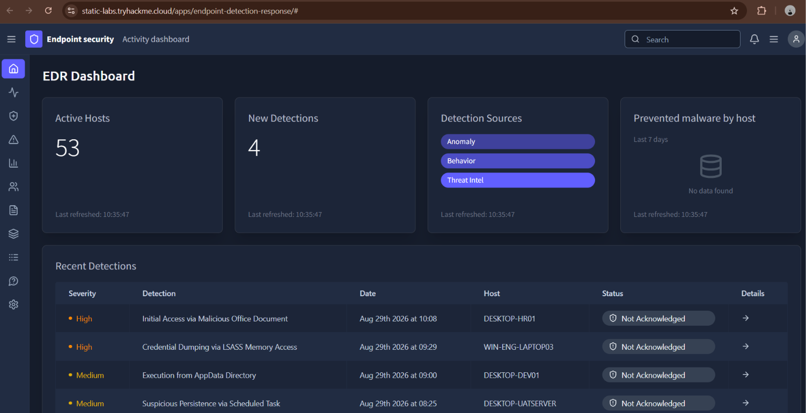
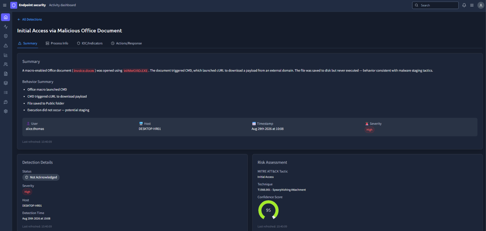
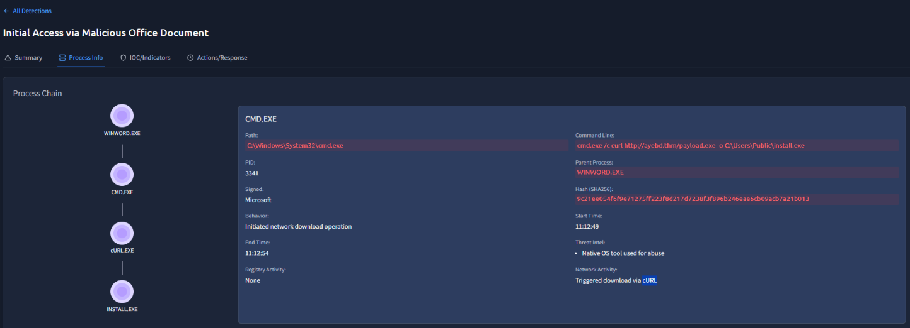
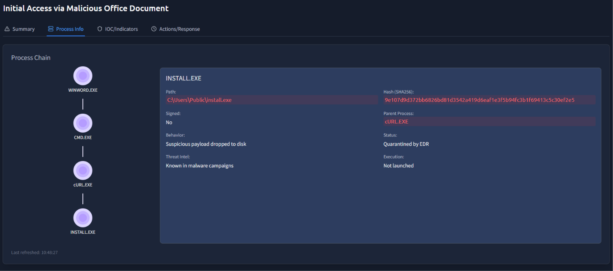
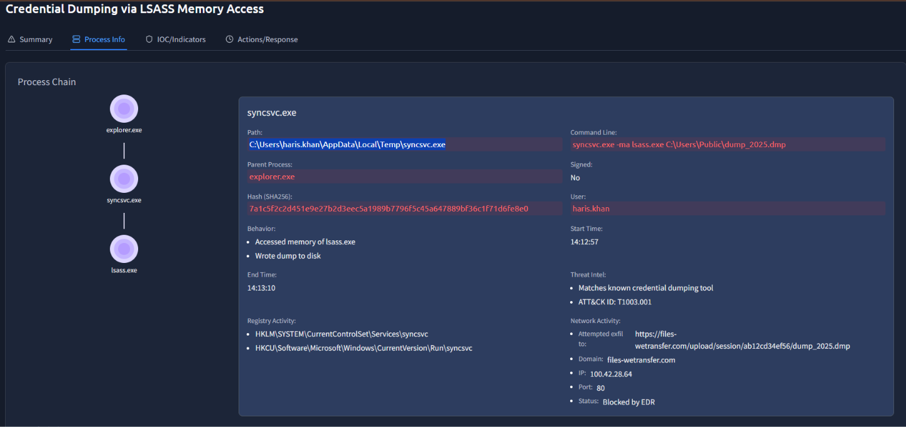
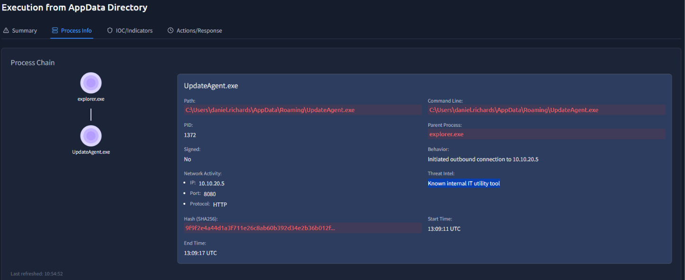

# Module 3: Core SOC Solutions
## Room 1: Intoduction to EDR
### What I learned about:
- Endpoint Detection and Response (EDR) is a widely adopted security solution designed to monitor, detect, and respond to advanced threats at the endpoint level. It offers deep-level protection for endpoints. No matter where the endpoints are, the EDR will make sure they are monitored constantly and threats are detected. It is a series of tools that monitor devices for activity that could indicate a threat.
- Some of the EDR solutions in the market:
    - [CrowdStrike Falcon](https://www.crowdstrike.com/wp-content/uploads/2022/03/crowdstrike-falcon-insight-data-sheet.pdf)
    - [Symantec EDR](https://docs.broadcom.com/doc/endpoint-detection-and-response-atp-endpoint-en)
    - [SentinelOne EDR](https://sentinelone.com/resources/datasheets/assets/usecase/sentinel-one-active-#page=1)
    - [Microsoft Defender for Endpoint](https://learn.microsoft.com/en-us/defender-endpoint/microsoft-defender-endpoint)
- Features of EDR: There are three main features of an EDR, which can also be referred to as the three pillars of an EDR solution.
  - Visibility: A good analysis often depends on the available level of visibility of the activity.  The level of visibility EDR provides is impressive. It collects detailed data from the endpoints, then presents this information in a very structured format to the analyst.
  - Detection: It incorporates signature-based detections as well as behavior-based detections, such as unexpected user activities. With modern machine learning capabilities, it identifies any deviation from the baseline behavior and instantly flags it. It can also detect fileless malware that resides in memory.
  - Response:  Imagine getting a detection on the EDR with full-fledged details on when, where, and what happened. As an analyst, you may decide to isolate a complete endpoint, terminate a process, or quarantine some files. You can also connect to the host remotely and execute actions independently. You can do this all from within the EDR console.

    > However, it's also important to remember that an EDR is a host-only security solution and does not detect network-level threats.
- The Antivirus (AV) may detect some basic threats, but to detect advanced threats that evade normal detections, we need an EDR.  
Note: Some modern AVs may have more enhanced visibility and detection. However, an EDR is ahead as it levels up the detection and response in an endpoint.  
- EDR's Working: 
   - Agents/Sensors: There are EDR agents deployed inside endpoints. They are the eyes and ears of the EDR. Their job is to sit at the endpoint and monitor all the activities. The information about these activities is sent in detail to the EDR central console in real time. The EDR agents can do some basic signature-based and behavior-based detections by themselves and send them to the EDR console, which triggers alerts.
   - EDR Console: All the detailed data sent by the EDR agents is correlated and analyzed through complex logic and machine learning algorithms. The threat intelligence information is matched with the collected data. The EDR is just like the brain connecting all the dots. These dots connect to form a detection, often called an alert. 
   - What after detection: SOC analyst acknowledges the alert and prioritizes it. The prioritization is made easy by the EDR itself. It gives severities to all the alerts. 
   - EDR with Other Tools: Within a network, Firewalls, DLPs, Email Security Gateways, IAMs, EDRs, and other security solutions protects the different components of the network. To minimize the effort and maximize the efficiency, all these security solutions are integrated with a SIEM solution that becomes the central point of investigation for the analysts. 
- EDR Telemetry
  - Telemetry: Collected data from different endpoints in EDR Console. Telemetry is the black box of an endpoint with everything necessary for detection and investigation.
  - Individually, the activities may seem harmless, but when observed through detailed telemetry, they tell a different story. This detailed telemetry not only helps the EDR detect advanced threats and make better judgments on the legitimacy of the activities, but it is also very helpful for the analysts during the investigations. The analysts can understand the full chain of events, identify the root cause, and reconstruct the attack timeline.
  - Some of the Telemetry collected may be as follows-
    - Process Executions and Terminations
    - Network Connections
    - Command Line Activity
    - Files and Folders Modifications
    - Registry Modifications etc
- Advanced detection techniques and the response mechanisms of an EDR.
  - Detection: Based on the telemetry received from the endpoints, some advanced detection techniques are applied to this data. Some of these techniques include:
    - Behavioral Detection
      - Advanced threats craft their malware to look clean and use legitimate processes to carry out their attack. EDR catches this behavior.
        - Example: A process winword.exe spawning PowerShell.exe will be flagged by the EDR due to the behavior. A Word document spawning a PowerShell is an unusual parent-child relationship.
    - Anomaly Detection
      - With time, EDR understands the baseline behavior of the endpoints. Any activity that deviates from this behavior will be flagged. Sometimes, this can generate false positives as well. However, with the full context it gives, the analyst can identify its legitimacy.
        - Example: On one of the endpoints, a process modifies an auto-start registry key, which is not a common behavior on the endpoint.
    - IOC matching
      - Except for zero-day attacks, most of the attacks have indicators published in the threat intelligence feeds. EDR flags any activity that matches any known IOC. 
        - Example: A user downloads a file that drops an executable. The executable is often used in a specific attack. The hash of this executable will get matched with the threat intelligence feed and instantly flagged by the EDR.
    - MITRE ATT&CK Mapping
        - Any activity flagged by the EDR is not only marked as malicious or suspicious but also mapped with the MITRE Tactic and Technique (attack stage) that the particular activity was on. This proves to be very helpful for the analysts.
          - Example: If the EDR flags the creation of a scheduled task for any reason, it will likely map this activity to the following:
            - Tactic: Persistence
            - Technique: Scheduled Task/Job
    - Machine Learning Algorithms
      - Modern EDRs have machine learning models trained by a large dataset of normal and malicious behaviors. This can detect complex patterns of an attack.
        - Example: Attacks in which the individual actions are not inherently malicious, but the ML algorithm identifies the whole chain of activities as malicious. Fileless attacks and multi-staged intrusions are often detected through this. 
- Response: EDR offers both automated and manual responses. You can make policies to block known malicious behaviors automatically. However, manual response gives you a wide range of response capabilities. 
  - Isolate Host: Most attacks start from a single endpoint and move laterally to other endpoints to compromise the whole network. Isolating the infected endpoint on time can stop this from happening.
  - Terminate Process: Some hosts run the core business operations, and isolating them can cause more loss than the malicious activity. The analysts get the option to terminate a process in the EDR. They can terminate any process at any time. This action should be taken consciously since terminating a legitimate process can disrupt the endpoint.
  - Quarantine: Quarantine ensures that the file is moved to an isolated location where it can not be executed. The analysts can then review the file to restore or permanently remove it. 
  - Remote Access: Analysts can also remotely access the shell of any endpoint. This is often done when the EDR's built-in response is not enough to take action on a specific activity. Through remote access, analysts can gain deeper visibility into the system or take custom actions within the endpoints. The analysts can also run scripts or collect their desired data from the host through remote access.
  - Artefacts Collection: Analysts can extract important artefacts from the endpoints without physically accessing the device. The most commonly extracted artefacts include:
    - Memory Dump
    - Event Logs
    - Specific Folder Contents
    - Registry Hives
- Practice:  The task is to answer questions based on the information/visibility provided by the EDR Console

  

    

  - Opened the first high alert to see details:  
    
  
  - Go to Process info (CMD.exe) to see if which tool was launched by CMD.exe to download the payload on DESKTOP-HR01
    

  - Switch to INSTALL.EXE to get the absolute path to the downloaded malware on the DESKTOP-HR01 machine
    
  
  - Absolute path to the suspicious syncsvc.exe on the WIN-ENG-LAPTOP03 machine
    

  - UpdateAgent.exe labelled by Threat Intel on DESKTOP-DEV01
    

### Key Takeaways
- The basics of EDR and how it works
- Differentiate EDR from traditional Antivirus solutions
- Architecture of an EDR solution
- Telemetry it collects from endpoints
- Understood the detection and response capabilities of an EDR
- Use of EDR Agents and Console
- Practiced investigating some detections on a simulated EDR
