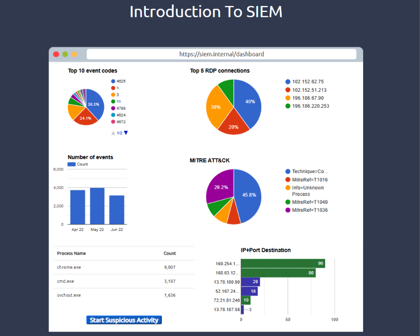
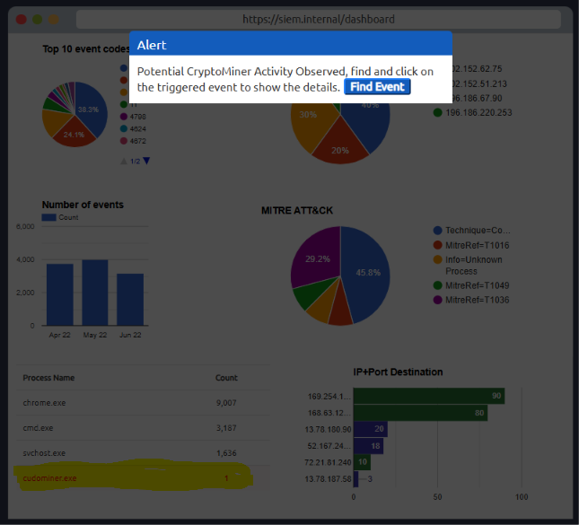
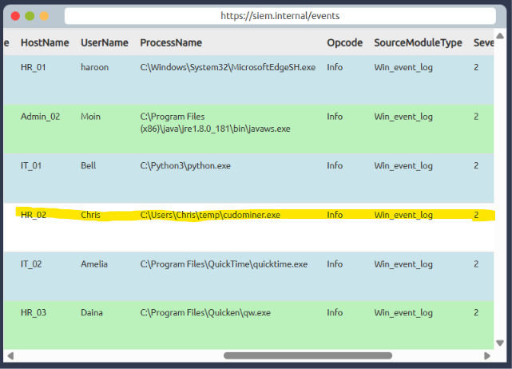
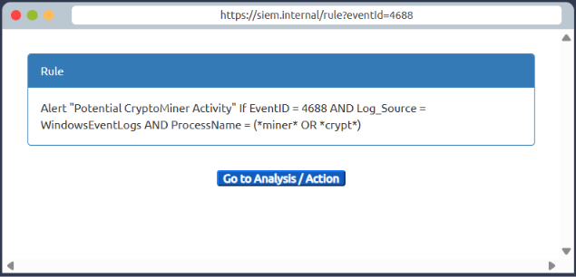
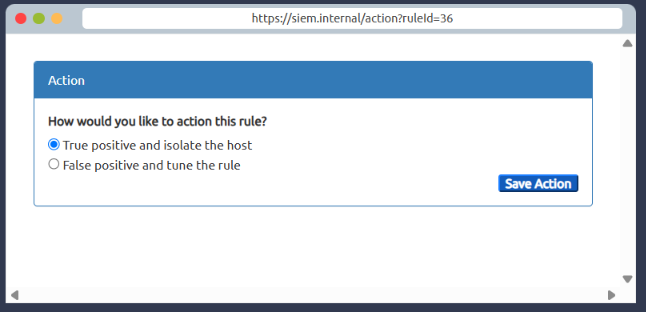

# Module 3: Core SOC Solutions
## Room 2: Intoduction to SIEM
### What I learned about:
- Log Sources-
   1) Host-Centric Log Sources: These log sources capture events that occurred within or related to the host. Devices that generate host-centric logs include Windows, Linux, servers, etc.
   2) Network-Centric Log Sources: Network-related logs are generated when the hosts communicate with each other or access the internet to visit a website. Devices that generate network-centric logs are firewalls, IDS/IPS, routers, etc.
      > Intrusion Detection System (IDS) is a system that detects unauthorised network and system intrusions.  
      Intrusion Prevention System (IPS) is a device or application that detects and stops intrusions attempts proactively. 
-  It seems pretty straightforward that these log sources generate logs, we analyze them, and identify malicious activities. However, it's not that simple. It has some challenges. Some of them are-
    - Numerous Log Sources
    - No Centralization
    - Limited Context
    - Limited Analysis
    - Format Issues
- What is SIEM?
    - Security Information and Event Management system that is used to aggregate security information in the form of logs, alerts, artifacts and events into a centralized platform that would allow security analysts to perform near real-time analysis during security monitoring. It collects logs from various types of log sources, standardizes their format into a consistent one, correlates them, and detects malicious activities using detection rules.
- Features of SIEM-
    - Centralized Log Collection: SIEM collects logs from all sources (endpoints, servers, firewalls, etc.) and centralizes them in one place.
    - Normalization of Logs- SIEM ensures that all the logs are broken down into different fields and presented in one consistent format. 
      > Note: Breaking down a log into several fields for ease of understanding is known as Parsing, and converting all the logs of various log sources into one consistent format is known as Normalization. 
    - Correlation of Logs- SIEM correlates the logs of different sources and finds any relationship between them. This helps to identify malicious activity by analyzing its pattern.
    - Real-time Alerting- When the conditions for detection rules are satisfied, alerts are triggered, and the analysts are notified.
    - Dashboards and Reporting- The summary of analysis is presented in the form of actionable insights with the help of multiple dashboards. 
- Windows Log Source- Windows records every event that can be viewed through the Event Viewer. It assigns a unique ID to each type of log activity, making it easy for the analyst to examine and keep track of. These logs from all Windows endpoints are forwarded to the SIEM solution for monitoring and better visibility.
- Linux Log Source- Linux OS stores all the related logs, such as events, errors, warnings, etc. These are then ingested into SIEM for continuous monitoring. Some of the common locations where Linux stores logs are:
   - /var/log/httpd: Contains HTTP Request  / Response and error logs.
   - /var/log/cron: Events related to cron jobs are stored in this location.
   - /var/log/auth.log and /var/log/secure: Stores authentication-related logs.
   - /var/log/kern: This file stores kernel-related events.
- Web Server Logs- It is important to monitor all requests/responses coming in and out of the web server for any potential web attack attempt. In Linux, common locations to write all apache-related logs are /var/log/apache or /var/log/httpd.
- Log Ingestion: Each SIEM solution has its own way of ingesting the logs. Some common methods used by these SIEM solutions are:
    - Agent / Forwarder: These SIEM solutions provide a lightweight tool called an agent (forwarder by Splunk) that gets installed on the Endpoint. It is configured to capture and send all the important logs to the SIEM server.

      > Splunk is a platform for collecting, storing, and analysing machine data. It provides various tools for analysing data, including search, correlation, and visualisation. It is a powerful tool that organisations of all sizes can use to improve their IT operations and security posture.
    - Syslog: Syslog is a widely used protocol to collect data from various systems like web servers, databases, etc., and send real-time data to the centralized destination.
    - Manual Upload: Some SIEM solutions, like Splunk, ELK, etc., allow users to ingest offline data for quick analysis. Once the data is ingested, it is normalized and made available for analysis.

       > ELK stands for Elasticsearch, Logstash, and Kibana. These are three open-source tools that are commonly used together to collect, store, analyse, and visualise data. 
    - Port-Forwarding: SIEM solutions can also be configured to listen on a certain port, and then the endpoints forward the data to the SIEM instance on the listening port.
- SIEM solution has detection rules that catch threats. These rules play an important role in the timely detection of threats, allowing analysts to take action on time. Detection rules are pretty much logical expressions set to be triggered.
- Once an alert is triggered, the events/flows associated with the alert are examined, and the rule is checked to see which conditions are met. Based on the investigation, the analyst determines if it's a True or False positive. Some of the actions that are performed after the analysis are:
   - Alert is a False Positive. It may require tuning the rule to avoid similar False positives from occurring again.
   - Alert is a True Positive. Perform further investigation.
   - Contact the asset owner to inquire about the activity.
   - Suspicious activity is confirmed. Isolate the infected host.
   - Block the suspicious IP.
- Practice: A suspicious activity happened, an Alert is triggered, which means some events matched the condition of some rule already configured. Investigated the alert and answered the questions asked in the task.

    
   - After clicking on the Start Suspicious Activity button, which process caused the alert?
      
   - Find the event that caused the alert and identify the user responsible for the process execution.
     
   - What is the hostname of the suspect user?
     - HR_02
   - Examine the rule and the suspicious process; which term matched the rule that caused the alert?
     
   - Which option best represents the event? Choose from the following: False Positive/True Positive
     
### Key Learning
- Learned various Log Sources- Windows, Linux, Server and and Logs Ingestion into SIEM.
- The importance and features of a SIEM solution.
- Understand the process behind alerting and alert analysis.
- Further rooms recommended by THM-
  - Junior Security Analyst Intro
  - Splunk: The Basics
  - Incident Handling with Splunk
  - Benign
  - Investigating with Splunk
  - Investgating with ELK
  - ItsyBitsy

      

      