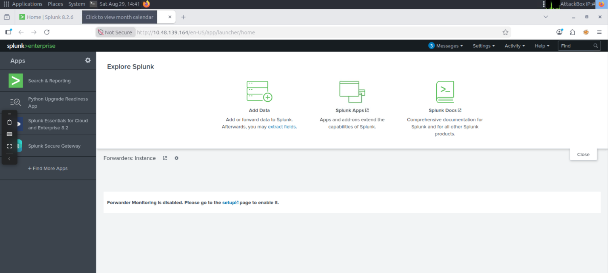
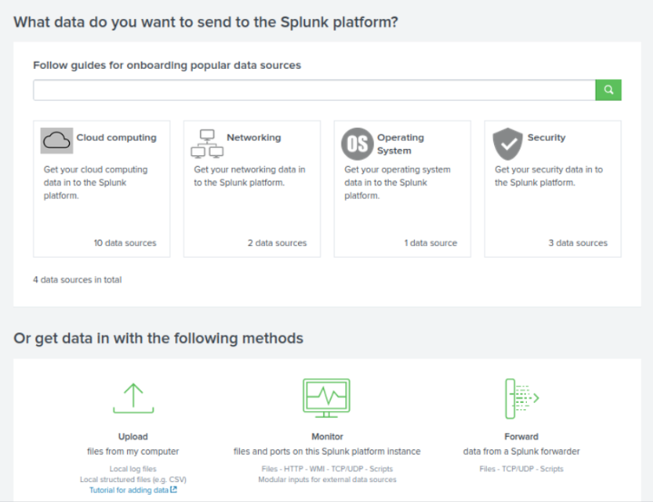
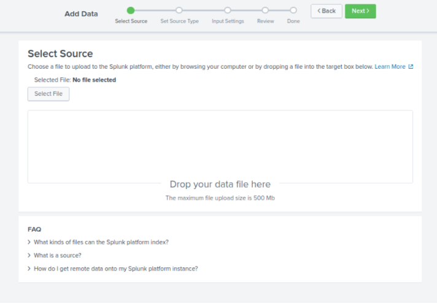
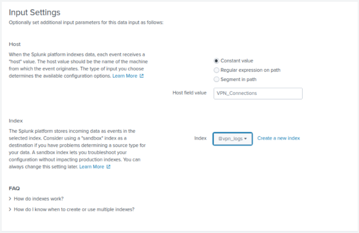
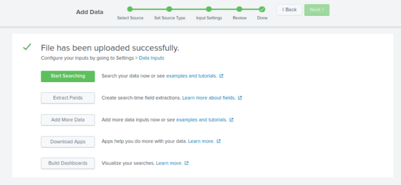
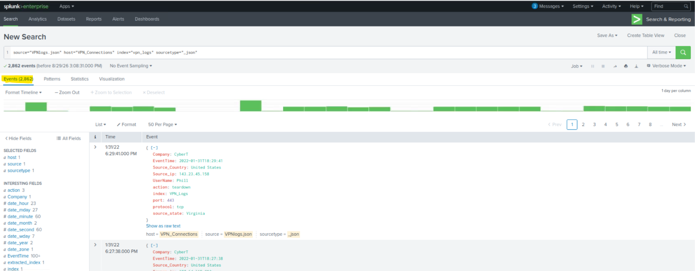
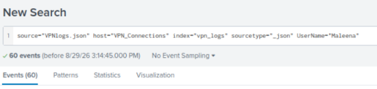
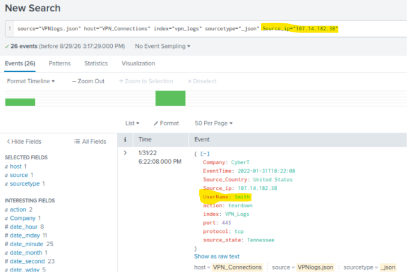
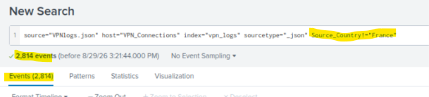
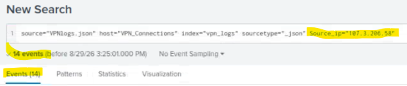

# Module 3: Core SOC Solutions
## Room 3: Splunk: The Basics
### What I learned about:
- Splunk- Splunk is *one of the leading SIEM solutions* in the market. Splunk is a platform for collecting, storing, and analysing machine data. It provides various tools for analysing data, including search, correlation, and visualisation.
- Splunk has three main components: Forwarder, Indexer, and Search Head. These components work together to help us search and analyze the data.
   - Splunk Forwarder: Splunk Forwarder is a lightweight agent installed on the endpoint intended to be monitored, and its main task is to collect the data and send it to the Splunk instance. 
   Some of the key data sources are:
       - Web server generating web traffic.
       - Windows machine generating Windows Event Logs, PowerShell, and Sysmon data.
       - Linux host generating host-centric logs.
       - Database generating DB connection requests, responses, and errors.    

     The forwarder collects the data from the log sources and sends it to the Splunk Indexer. 
    - Splunk Indexer: It parses and normalizes the data into field-value pairs, categorizes it, and stores the results as events, making the processed data easy to search and analyze.
    - Search Head: The searches are done using the SPL (Search Processing Language), a powerful query language for searching indexed data. When the user performs a search, the request is sent to the indexer, and the relevant events are returned as field-value pairs.  
    The Search Head also allows you to transform results into presentable tables and visualizations such as pie, bar, and column charts.  
- Splunk dashboard: Explored the Splunk dashboard
    
- Practical-
    - After clicking on Add Data: 
    
    - After clicking on Upload, select the file, then next: 
    
    - Set source type to json, then next.
    - In Input Settings, write "VPN_Connections" in Host Field Name and create a new index "VPN_logs", save it, and select this newly created index, then Review and then Submit.
    
    - Click on Start Searching and answered the questions
    
    - How many events are present in the log file?  2862
    
    - How many log events are captured by the user Maleena?  60
    
    - What is the username associated with IP 107.14.182.38?  smith
    
    - What is the number of events that originated from all countries except France?  2814
    
    - How many VPN events were associated with the IP 107.3.206.58?  14
    
### Key Learning
- Learned importance of Splunk Components
- Navigated and explored splunk dashboard
- Uploaded vpn logs file and with queries and search, filtered the data required and answered the questions

