# Module 3: Core SOC Solutions
## Room 4: Elastic Stack: The Basics
### What I learned about:
- ELK- ELK stands for Elasticsearch, Logstash, and Kibana. These are three open-source tools that are commonly used together to collect, store, analyse, and visualise data.  
ELK was originally developed to store, search, and visualize large amounts of data. Organizations used it to monitor application performance and perform searches on large datasets.  
Over time, its features made it popular in security operations as well. Now, many SOC teams use ELK almost as a SIEM solution.
- ELK's Core Components:
    - Elasticsearch: The first component, Elasticsearch, is a full-text search and analytics engine for JSON-formatted documents. It stores, analyzes, and correlates data and supports a RESTful API for interacting with it.

      >API, stands for Application Programming Interface, is a set of rules and protocols for building software and applications. An API allows different software programs to communicate with each other. 
    -  Logstash: Logstash is a data processing engine that takes data from different sources, filters it, or normalizes it, and then sends it to the destination, which could be Kibana or a listening port.
    A Logstash configuration file is divided into three parts: Input, Output, and Filter.
    - Beats: Beats are host-based agents known as data-shippers that ship/transfer data from the endpoints to Elasticsearch. Each beat is a single-purpose agent that sends specific data to Elasticsearch.  
    Beats Family-

      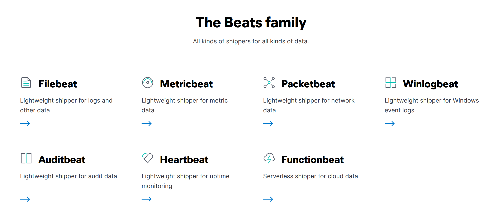

    - Kibana: Kibana is a web-based data visualization tool that works with Elasticsearch to analyze, investigate, and visualize data streams in real time. It allows users to create multiple visualizations and dashboards for better visibility.
- How they Work Together:  
   - Beats collect data from multiple agents. For example, Winlogbeat collects Windows event logs, and Packetbeat collects network traffic flows.  
   - Logstash collects data from beats, ports, or files, parses/normalizes it into field value pairs, and stores them into Elasticsearch.  
   - Elasticsearch acts as a database used to search and analyze data.  
   - Kibana is responsible for displaying and visualizing the data stored in Elasticsearch. The data stored in Elasticsearch can easily be shaped into different visualizations, time charts, infographics, etc., using Kibana.
- Lab Connection  

   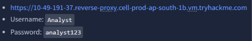

   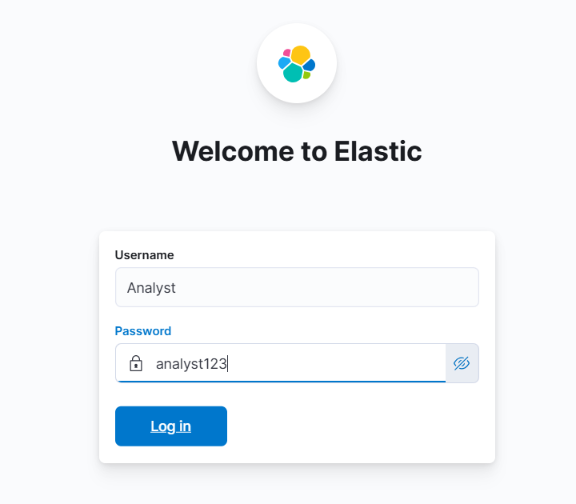

   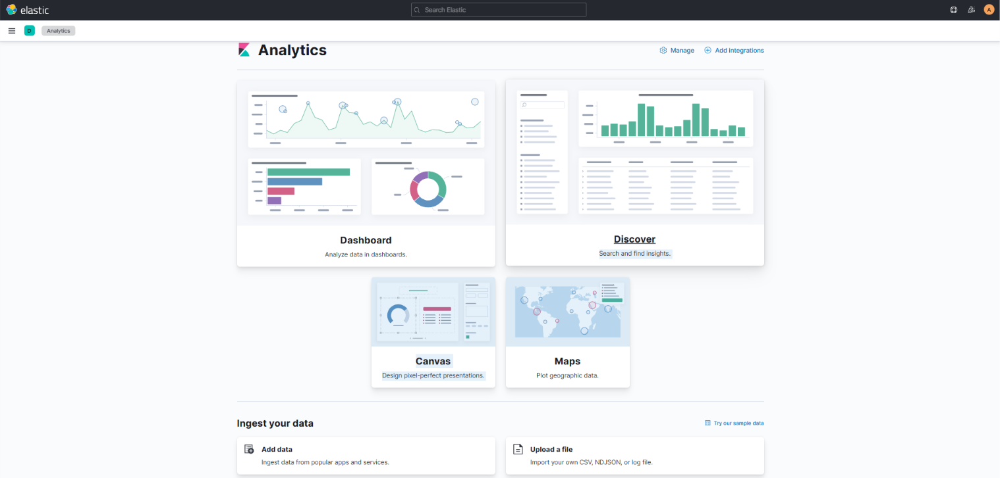

- Click on Discover and set the kibana time picker: 31st December 2021 to 2nd Feb 2022 (to answer the questions-instructed by THM) and Submit and then the dashboard with chart and logs appears.
   - Select the index vpn_connections and filter from 31st December 2021 to 2nd Feb 2022. How many hits are returned?  2861

      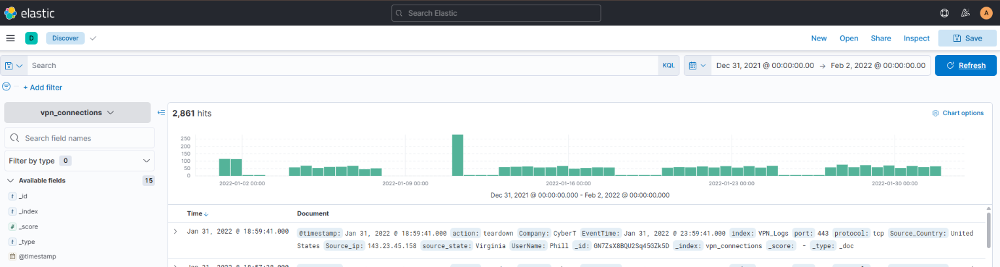
   
   - How many connections were observed from IP 238.163.231.224, excluding the New York state?

      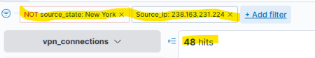

   - Create a table with the fields IP, UserName, Source_Country and save.

      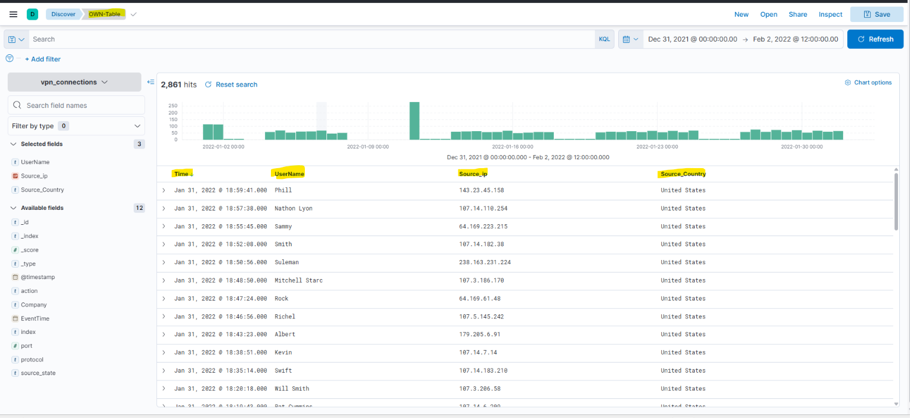

- KQL Query- KQL (Kibana Query Language) is a search query language used to search the ingested logs/documents in Elasticsearch. With KQL, we can search for the logs in two different ways.
   - Free text search: A simple search of the term 'security' will return all the documents that contain this term, irrespective of the field.KQL looks for the whole term/word in the documents. KQL allows the wildcard * to match parts of the word. Besides that, logical operators- AND, OR, NOT are also used.
   - Field-based search: This search has a special syntax as Field: Value. It uses a colon as a separator between the field and the value.
- Creating Visualizations: The visualization tab allows us to visualize the data in different forms such as tables, pie charts, bar charts, etc.  

   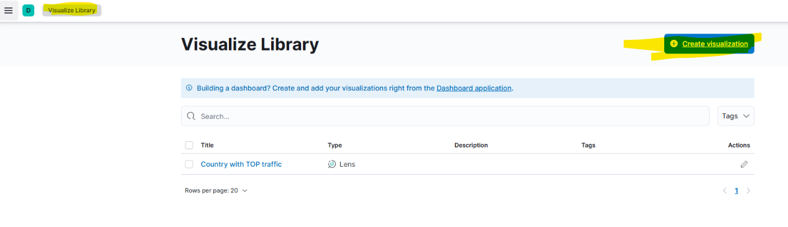
   - OR go to Source_ip and then visualize-  

      
   - drag both sourceip and source country to create a pie. 

      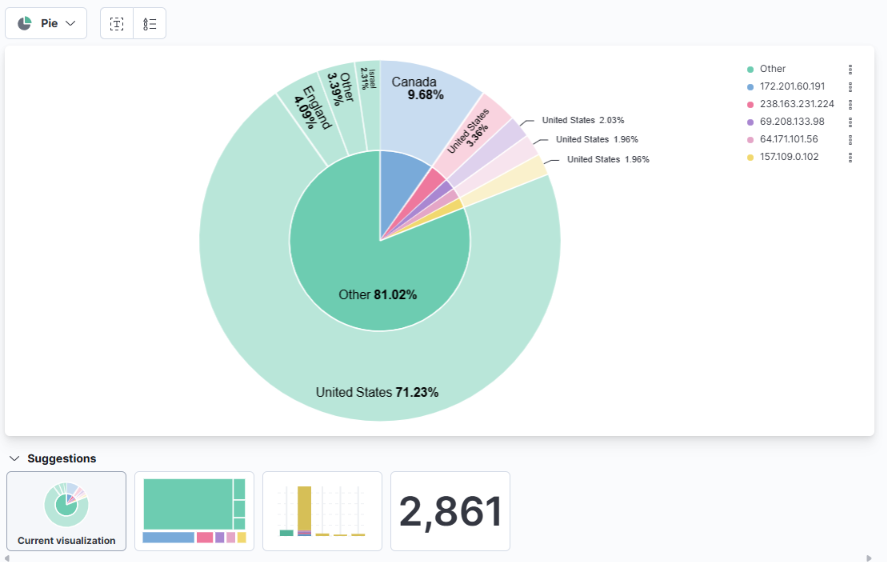

   - save it.

      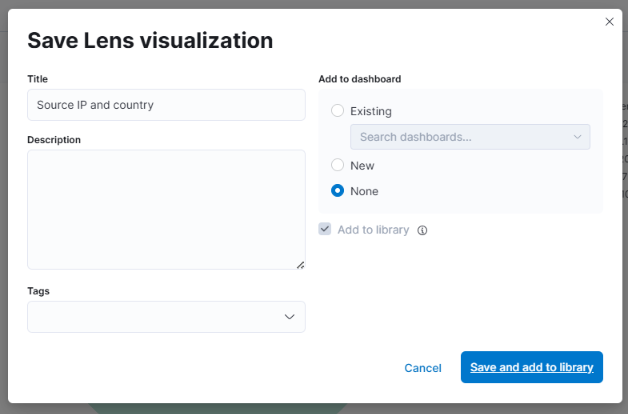

   - Go to Visualize library then create visualization

      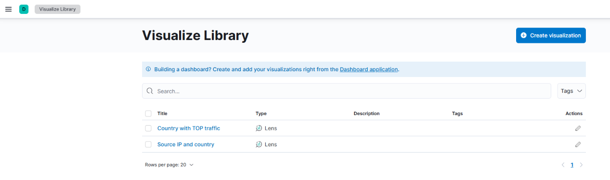

   - Click on lens

      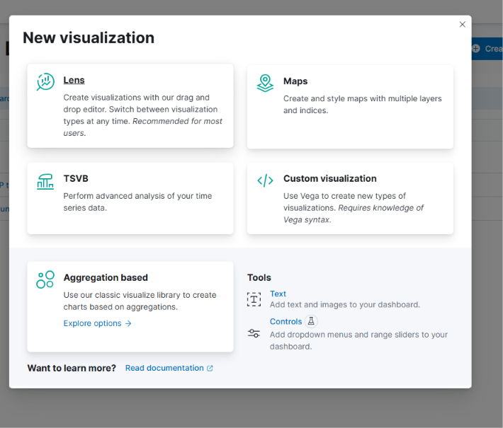

   - add filter- action:failed and save it.

      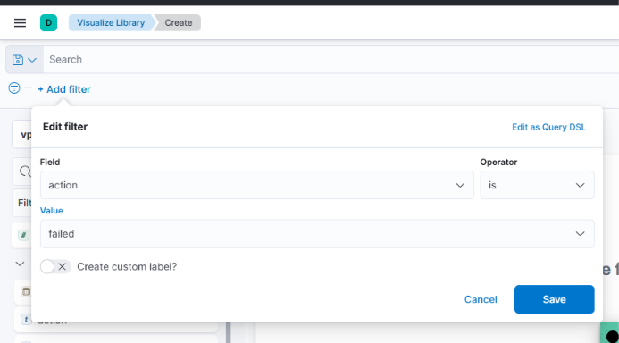

   - Drag Username field in and select donut, it displayed the user with the greatest number of failed attempts

      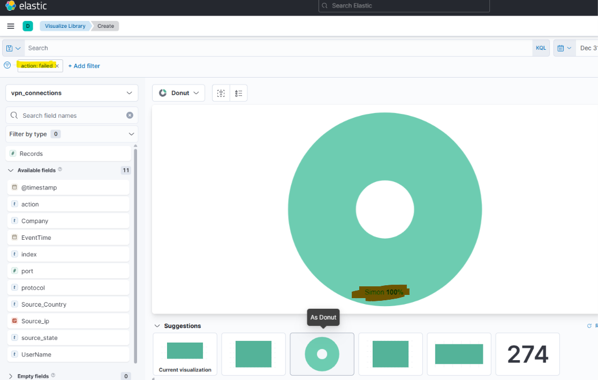

- Created the dashboard by selecting the saved visualizations and tables.

   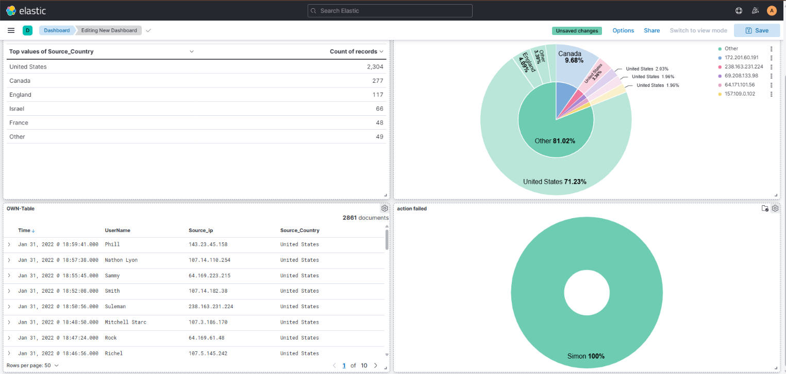

### Key Learning
- Learned about ELK and its core components
- How Beats, Logstash, Elasticstash, and Kibana works together, playing an important part in SOC team. 
- Explored the ELK site.
- Applied filters and learned kql query usage to filter the logs accordingly.
- Created table and saved it
- Created visualizations and saved it.
- Finally, created the dashboard by selecting the saved tables and visualizations.
