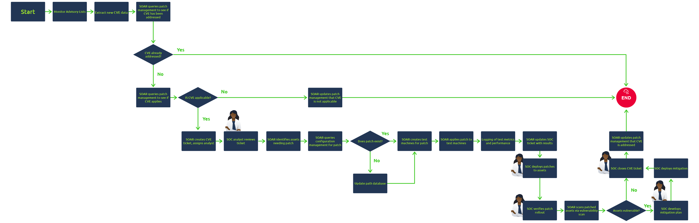
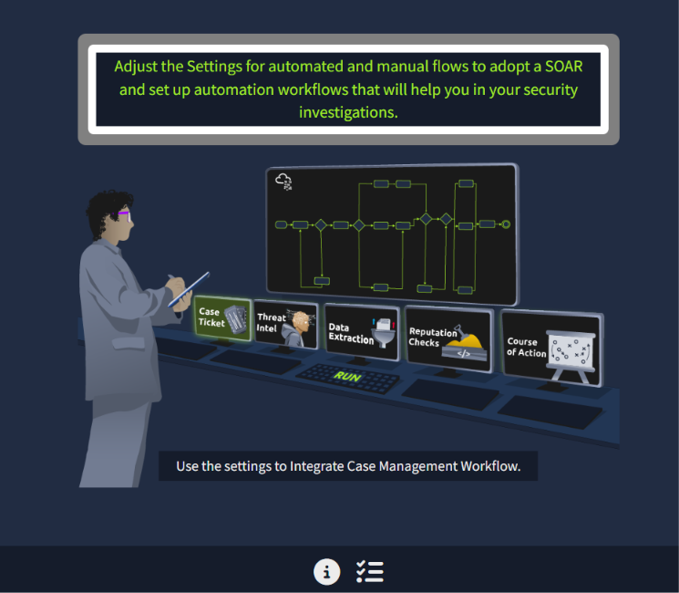
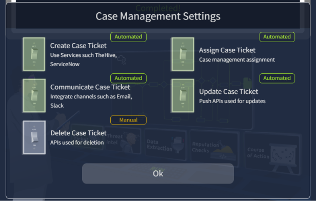
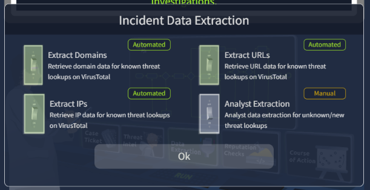
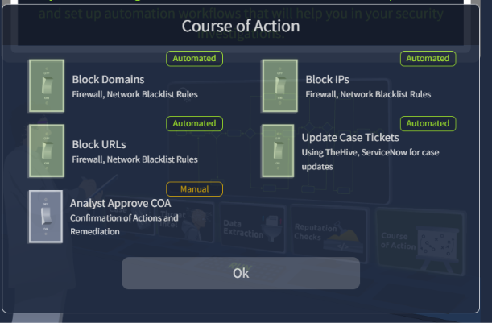
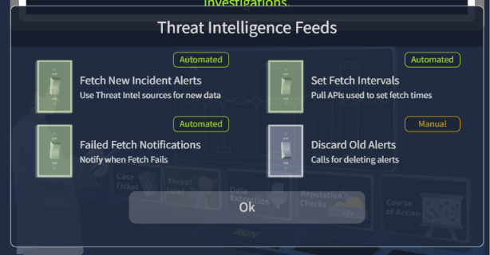
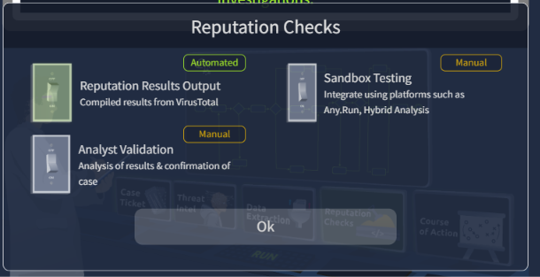
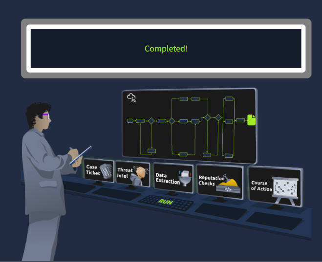

# Module 3: Core SOC Solutions
## Room 5: Introduction to SOAR
### What I learned about:
- What is SOAR?  
    Security Orchestration, Automation, and Response (SOAR) is a tool that unifies all the security tools used in a SOC. With SOAR, SOC analysts do not need to switch between SIEM, EDR, Firewall, and other security tools for their investigations. It also provides ticketing and case management features to the analysts, through which they can document, track, and resolve their incidents in a structured way.
- Three Main Capabilities-
    - Orchestration: It connects different tools from various vendors within the unified SOAR interface. It defines workflows for investigating various types of alerts, known as Playbooks. 

        > Notes: These playbooks are predefined steps that tell the SOAR how to investigate an alert. These playbooks are dynamic and usually contain different paths. The result of each step determines the next action.
    
    - Automation: Automation means no more manual clicks needed from SOC analysts. SOAR will itself follow the playbooks. This saves a tremendous amount of time for SOC analysts. They can handle hundreds of alerts without burning out.  
    - Response: SOAR gives the ability to take actions using different tools from one unified interface.

  > Note: While a SOAR tool can automate the majority of repetitive tasks, it does not replace SOC analysts.  
A SOC analyst understands the threats in the broader business context. SOAR would ease the burden of SOC by automating repetitive tasks and organizing everything in a simplified structure but complex investigations still require a SOC analyst.

- CVE Patching Playbook  
A CVE (Common Vulnerabilities and Exposures) is a vulnerability that is disclosed publicly and assigned a CVE number. As part of vulnerability management, the SOC team has to address newly released CVEs by verifying whether they exist in their network and patching them if they do.  An analyst must always be on the lookout for publications on new CVEs and remediation plans.  
The process can become overwhelming, resulting in a mounting backlog and patches not being applied, leaving the environment more vulnerable. Moreover, this process can take a lot of time and resources of the SOC team since CVEs are released frequently.  
So, to solve this problem, we can make a playbook for handling the CVEs inside the SOAR tool, just like we did for the phishing case.
This playbook will analyse the CVE details, assess its risk threshold, create a patching ticket, and test the patch before being pushed to the production environment. 

   

- Practical: The job is to determine and set which parts of the workflow should be manual or automated by clicking on the screens and toggling the switches.  
    
    

    

    

    

    

    

    

### Key Learning
- Traditional SOC processes and their challenges
- How SOAR overcomes these challenges with Orchestration, Automation and Response.
- SOAR playbooks (e.g. CVE Patching Playbook)
- Identified if what part can be manual or automated in a SOAR playbook (as in the last practical)
