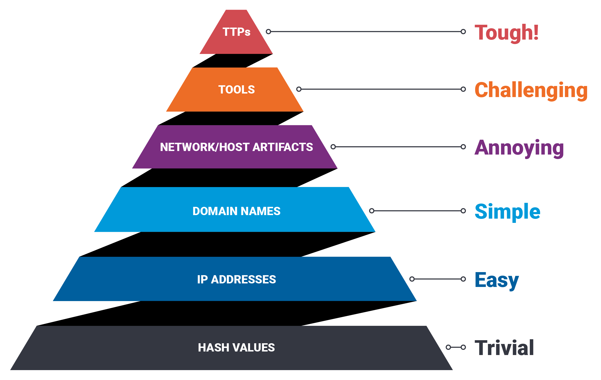

# Module 4: Cyber Defence Frameworks
## Room 1: Pyramid of Pain
### What I learned about:
- Pyramid of pain is a cybersecurity model created by David J. Bianco in 2013 that shows how much "pain" or operational difficulty an attacker experiences when defenders block or detect specific IOCs (Indicators of Compromise).  
The model is shaped like a pyramid. The bottom layers are easy for defenders to block but cause very little pain or extra work for the attacker. The top players are harder for defenders to detect but cause massive pain and force attackers to completely redesign their methods when caught.
- The layer of the Pyramid (Bottom to Top)  

    - Hash Values (Trivial): A hash is not considered to be cryptographically secure if two files have the same hash value or digest. Security professionals usually use the hash values to gain insight into a specific malware sample, a malicious or a suspicious file, and as a way to uniquely identify and reference the malicious artifact.  
    Various online tools can be used to do hash lookups like [VirusTotal](https://www.virustotal.com/gui/) and [Metadefender Cloud - OPSWAT](https://metadefender.opswat.com/?lang=en).    
    As an attacker, modifying a file by even a single bit is trivial, which would produce a different hash value. With so many variations and instances of known malware or ransomware, threat hunting using file hashes as the IOC (Indicators of Compromise) can become difficult.  

    - IP Address (Easy): From a defense standpoint, knowledge of the IP addresses an adversary uses can be valuable. A common defense tactic is to block, drop, or deny inbound requests from IP addresses on your parameter or external firewall. This tactic is often not bulletproof as it’s trivial for an experienced adversary to recover simply by using a new public IP address.  
    One of the ways an adversary can make it challenging to successfully carry out IP blocking is by using Fast Flux. Fast Flux is a DNS technique used by botnets to hide phishing, web proxying, malware delivery, and malware communication activities behind compromised hosts acting as proxies.  
    The purpose of using the Fast Flux network is to make the communication between malware and its command and control server (C&C) challenging to be discovered by security professionals. So, the primary concept of a Fast Flux network is having multiple IP addresses associated with a domain name, which is constantly changing.  

    - Domain Names (Simple): Domain Names can be a little more of a pain for the attacker to change as they would most likely need to purchase the domain, register it and modify DNS records. Unfortunately for defenders, many DNS providers have loose standards and provide APIs to make it even easier for the attacker to change the domain.  
       - What is Punycode?  
       Punycode is a way of converting words that cannot be written in ASCII, into a Unicode ASCII encoding.  
       Punycode attack is used by the attackers to redirect users to a malicious domain that seems legitimate at first glance.

       To detect malicious domains, proxy logs or web server logs can be used.  
       Attackers usually hide the malicious domains under URL shorteners. 
       - What are URL shorteners?  
       A URL Shortener is a tool that creates a short and unique URL that will redirect to the specific website specified during the initial step of setting up the URL Shortener link.  The attackers normally use the following URL-shortening services to generate malicious links: bit.ly, goo.gl, ow.ly etc.
       > Note: You can see the actual website the shortened link is redirecting you to by appending "+" to it. Type the shortened URL in the address bar of the web browser and add "+" character to see the redirect URL.   

    - Host Artifacts (Annoying): Host artifacts are the traces or observables that attackers leave on the system, such as registry values, suspicious process execution, attack patterns or IOCs (Indicators of Compromise), files dropped by malicious applications, or anything exclusive to the current threat.  
    On this level, the attacker will feel a little more annoyed and frustrated if you can detect the attack. The attacker would need to circle back at this detection level and change his attack tools and methodologies. This is very time-consuming for the attacker, and probably, he will need to spend more resources on his adversary tools.  

    - Network Artifacts (Annoying): A network artifact can be a user-agent string, C2 information, or URI patterns followed by the HTTP POST requests. An attacker might use a User-Agent string that hasn’t been observed in your environment before or seems out of the ordinary.  
      > The User-Agent is defined by RFC2616 as the request-header field that contains the information about the user agent originating the request.   

      > Command and Control (C2) Infrastructure are a set of programs used to communicate with a victim machine.  

      Network artifacts can be detected in PCAPs (file that contains the network packet dumps) by using a tool such as Wireshark or TShark, or exploring IDS (Intrusion Detection System) alerts from a tool such as Snort.  
      > Snort is the foremost Open Source Intrusion Prevention System (IPS) in the world. Snort IPS uses a series of rules that help define malicious network activity and uses those rules to find packets that match against them and generates alerts for users.

      It's hard to attribute the requests to a specific malware from the first glance, but you can dig deeper and look for its network indicators, such as the User-Agent. In TShark, you could use the following command:   
         `tshark --Y http.request -T fields -e http.host -e http.user_agent -r analysis_file.pcap`   

      If you can detect the custom User-Agent strings that the attacker is using, you might be able to block them, creating more obstacles and making their attempt to compromise the network more annoying.  

   - Tools (Challenging): It will be a game over for the attackers as they would need to invest some money into building a new tool, find the tool that has the same potential, or even gets some training to learn how to be proficient in a certain tool.   
   Attackers would use the utilities to create malicious macro documents (maldocs) for spearphishing attempts, a backdoor that can be used to establish C2 (Command and Control Infrastructure)(opens in new tab), any custom .EXE, and .DLL files, payloads, or password crackers.  
   Antivirus signatures, detection rules, and YARA rules can be great weapons for you to use against attackers at this stage.  
      > [MalwareBazaar](https://bazaar.abuse.ch/) and [Malshare](https://malshare.com/) are good resources to provide you with access to the samples, malicious feeds, and YARA results - these all can be very helpful when it comes to threat hunting and incident response.  
      
      > For detection rules, [SOC Prime Threat Detection Marketplace](https://tdm.socprime.com/login) is a great platform, where security professionals share their detection rules for different kinds of threats including the latest CVE's that are being exploited in the wild by adversaries. 

      > Fuzzy hashing is also a strong weapon against the attacker's tools.  
      Fuzzy hashing helps you to perform similarity analysis - match two files with minor differences based on the fuzzy hash values. One of the examples of fuzzy hashing is the usage of [SSDeep](https://ssdeep-project.github.io/ssdeep/index.html)

   - TTPs (Tough): TTPs stands for Tactics, Techniques & Procedures. This includes the whole [MITRE ATT&CK Matrix](https://attack.mitre.org/), which means all the steps taken by an adversary to achieve his goal, starting from phishing attempts to persistence and data exfiltration.   
   If you can detect and respond to the TTPs quickly, you leave the adversaries almost no chance to fight back. For, example if you could detect a Pass-the-Hash(opens in new tab) attack using Windows Event Log Monitoring and remediate it, you would be able to find the compromised host very quickly and stop the lateral movement inside your network.   

      At this point, the attacker would have two options:  
      - Go back, do more research and training, reconfigure their custom tools
      - Give up and find another target
   
   - Completed the practical of identifying the levels of pyramid of pain and retrieved the flag. 

### Key Learning
   - Understood the importance of Pyramid of pain and the levels of difficulty for the attacker increasing as we go up the pyramid of pain.
   - Various levels and how they affects the attacker's tactics.
   - 

       