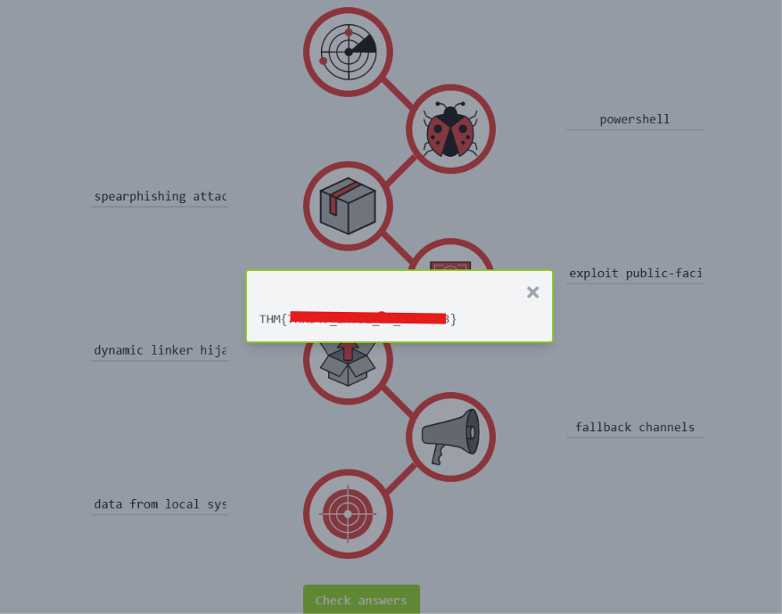

# Module 4: Cyber Defence Frameworks
## Room 2: Cyber Kill Chain
### What I learned about:
- Cyber Kill Chain- The framework is introduced by Lockheed Martin, a global security and aerospace company in 2011, based on military concept.   
To succeed, an adversary needs to go through all phases of the Kill Chain.   
The Cyber Kill Chain helps understand and protect against ransomware attacks, security breaches as well as Advanced Persistent Threats (APTs).   
Attack Phases- 
    1) Reconnaissance- It is the research and planning phase of an attack against a system or victim.  Reconnaissance is often passive and undetected.  
    Adversaries gathers information about their target. This information can include infrastructure details, employee data, business processes, and exposed technologies.   
    A valuable piece of recon is OSINT (Open-Source Intelligence). With OSINT, adversaries gather insights about their target through publicly available information. ["What is OSINT?"](https://www.varonis.com/blog/what-is-osint/)  
    Reconnaissance Types- 
        - Passive Recon: This involves having no direct interaction with the target. This may include WHOIS lookups, social media scraping, or reviewing breach data.
        - Active Recon: This involves direct contact with the target with activities such as social engineering, port scanning, banner grabbing, or probing for open services.   

        Email harvesting is the process of obtaining email addresses from public, paid, or free services. An attacker can use email-address harvesting for a phishing attack. Tools they might use-    
        - [theHarvester](https://github.com/laramies/theHarvester): other than gathering emails, this tool is also capable of gathering names, subdomains, IPs, and URLs using multiple public data sources.
        - [ Hunter.io](https://hunter.io/): this is an email hunting tool that will let you obtain contact information associated with the domain.
        - [OSINT Framework](https://osintframework.com/): OSINT Framework provides the collection of OSINT tools based on various categories.   
    2) Weaponization- Most attackers usually use automated tools to generate the malware or refer to the [DarkWeb](https://www.kaspersky.com/resource-center/threats/deep-web) to purchase the malware. More sophisticated actors or nation-sponsored APT (Advanced Persistent Threat Groups) would write their custom malware to make the malware sample unique and evade detection on the target.  
        > Malware is a program or software that is designed to damage, disrupt, or gain unauthorized access to a computer.

        > Exploits are programs or code that take advantage of the vulnerability or flaw in the application or system.

        > A payload is a malicious code that the attacker runs on the system.  

        In the Weaponization phase, the attacker can adopt the following tactics:  

        - Create an infected Microsoft Office document containing a malicious macros or VBA (Visual Basic for Applications) scripts.  

        - Create a malicious payload or a very sophisticated worm, implant it on USB drives, and then distribute them in public.  

        - Set up Command and Control (C2) infrastructure for executing the commands on the victim's machine or deliver more payloads.  

        - Infect the victim's host with a backdoor, which would provide a way to access the computer system, and bypass the security mechanisms.  

        - Tailoring phishing templates or OAuth-consent apps to look legitimate and dupe the victim.   
    3) Delivery- Delivery is when an attacker decides to choose the method for transmitting the payload or the malware onto the target environment. There are plenty of options to choose from:  
        - Phishing email: would target either a specific person (spear phishing attack) or multiple people in the company. The email would contain a malicious link or email attachment that would result into a compromise.  
        - USB drops offer the attacker a physical delivery medium into public places like coffee shops, car parks, or on the street.  
        - **Watering hole attacks** are targeted and designed to aim at a specific group of people by compromising the website they are usually visiting, redirecting them to a malicious website of the attacker's choice or creation. Victims would unintentionally download malware or a malicious application to their computer, resulting in a drive-by download.  
    
    4) Exploitation- Exploitation is the moment the attacker's code executes on the target, taking advantage of a known vulnerability.  
    An attacker can opt to utilise a number of key techniques to gain access:
        - Malicious macro execution: This may have been delivered through a phishing email, that would execute ransomware when the victim opens it.
        - Zero-day exploits: These leverages on unknown and unpatched flaws in a system. These exploits leave no opportunity for detection at the beginning.
        - Known CVEs: The attacker can choose to exploit unpatched public vulnerabilities found on the target environment.  

        After gaining access to the system, the malicious actor could exploit software, system, or server-based vulnerabilities to escalate the privileges or move laterally through the network.  

        Signs of exploitation to look out for include:
        - Unexpected process spawns.
        - Registry changes or new services created.
        - Suspicious command-line arguments found in system logs.  

    5) Installation: A [persistent backdoor](https://www.offensive-security.com/metasploit-unleashed/persistent-backdoors/) will be installed by the attacker to access the system he compromised in the past.  
     
       The persistence can be achieved through:

        - Installing a web shell on the webserver. A web shell is a malicious script written in web development programming languages such as ASP, PHP, or JSP used by an attacker to maintain access to the compromised system. Because of the web shell simplicity and file formatting (.php, .asp, .aspx, .jsp, etc.) can be difficult to detect and might be classified as benign.
        - Installing a backdoor on the victim's machine. For example, the attacker can use [Meterpreter](https://www.offensive-security.com/metasploit-unleashed/meterpreter-backdoor/) to install a backdoor on the victim's machine. Meterpreter is a Metasploit Framework payload that gives an interactive shell from which an attacker can interact with the victim's machine remotely and execute the malicious code.
        - Creating or modifying Windows services. This technique is known as [T1543.003](https://attack.mitre.org/techniques/T1543/003/) on MITRE ATT&CK (MITRE ATT&CK® is a knowledge base of adversary tactics and techniques based on real-world scenarios). An attacker can create or modify the Windows services to execute the malicious scripts or payloads regularly as a part of the persistence. An attacker can use the tools like ssc.exe (sc.exe lets you Create, Start, Stop, Query, or Delete any Windows Service) and [Reg](https://attack.mitre.org/software/S0075/) to modify service configurations. The attacker can also [masquerade](https://attack.mitre.org/techniques/T1036/), the malicious payload by using a service name that is known to be related to the Operating System or legitimate software.
        - Adding the entry to the "run keys" for the malicious payload in the Registry or the Startup Folder. By doing that, the payload will execute each time the user logs in to the computer. According to MITRE ATT&CK, there is a startup folder location for individual user accounts and a system-wide startup folder that will be checked no matter what user account logs in.  

        The attacker can also use the [Timestomping](https://attack.mitre.org/techniques/T1070/006/) technique to avoid detection by the forensic investigator and also to make the malware appear as a part of a legitimate program. The timestomping technique lets an attacker modify the file's timestamps, including to modify, access, create and change times.  
    6) Command and Control- Attacter opens up the C2 (Command and Control) channel through the malware to remotely control and manipulate the victim. This term is also known as C&C or C2 Beaconing as a type of malicious communication between a C&C server and malware on the infected host. The infected host will consistently communicate with the C2 server; that is also where the beaconing term came from.   
    The compromised endpoint would communicate with an external server set up by an attacker to establish a command & control channel.  
    Until recently, IRC (Internet Relay Chat) was the traditional C2 channel used by attackers. This is no longer the case, as modern security solutions can easily detect malicious IRC traffic.   

        The most common C2 channels used by adversaries include:
        - HTTP on port 80 and HTTPS on port 443, where this type of beaconing blends the malicious traffic with the legitimate traffic and can help the attacker evade firewalls.
        - DNS (Domain Name Server), where the infected machine makes constant DNS requests to the DNS server that belongs to an attacker, this type of C2 communication is also known as DNS Tunneling.  

           > Note: Important to note that an adversary or another compromised host can be the owner of the C2 infrastructure.

    7) Action on Objectives (Exfiltration)-  With hands-on keyboard access, the attacker can achieve the following: 
        - Collect the credentials from users.
        - Perform privilege escalation (gaining elevated access like domain administrator access from a workstation by exploiting the misconfiguration).
        - Internal reconnaissance (for example, an attacker gets to interact with internal software to find its vulnerabilities).
        - Lateral movement through the company's environment.
        - Collect and exfiltrate sensitive data.
        - Deleting the backups and shadow copies. Shadow Copy is a Microsoft technology that can create backup copies, snapshots of computer files, or volumes. 
        - Overwrite or corrupt data.

- Practical: 
    

### Key Learnings
- Understood Cyber Kill Chain and it's importance for SOC analyst, threat hunters etc.
- Various phases of cyber kill chain
- The Cyber Kill Chain framework is designed for identification and prevention of the network intrusions. 

    